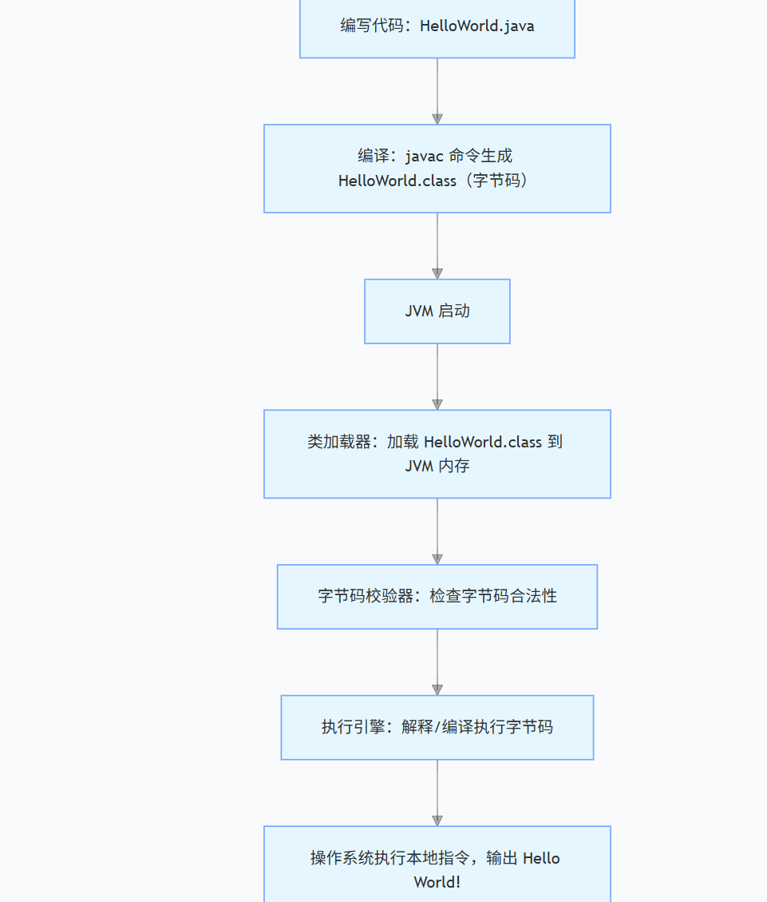

1. Java的引用本质上≈C++指针（安全版、自动版、不能运算的指针），但它完全不是C++的引用（&）
    * 存的都是地址
      * C++ 指针：存对象地址
      * Java 引用：存对象地址
    * 都是间接访问对象：通过指针/引用找到堆里的对象
    * 多个指针/引用可以指向同一个对象
      * C++：int* p1 = &a; int* p2 = p1;
      * Java：Student s1 = new Student(); Student s2 = s1;（new会有两步，第一步是从堆上划分内存，然后将其地址赋给栈上的引用类型s1）
    * 都可以为空
      * C++：ptr = nullptr；
      * Java：ref = null；
    * 赋值都是“改指向”，不是拷贝对象
      * C++： p = q；改指针指向
      * Java： s = t；改引用指向
2. Java引用比C++指针少了什么？（Java只是把指针的危险功能全部删掉了）
    * 不能做指针运算
      * C++：p++、p+1 可以乱跳地址
      * Java：完全不行
    * 不能直接操作内存地址：看不到真实地址，也不能强转
    * 没有多级引用
      * C++：int **p；
      * Java没有引用的引用
    * 不用手动free/delete：JVM自动GC
3. Java 引用 ≠ C++ 引用（&）
    * C++ 引用（int& ref = a）
      * 是变量别名
      * 一旦绑定，终身不能改指向
      * 没有自己的内存空间
      * 不能为空
    * Java 引用（Student s）
      * 是存地址的变量
      * 可以随时改指向别的对象
      * 有自己的栈内存
      * 可以 = null
4. Java的注释语法和C++/C是一样的，用"//"
5. Java中的所有引用类型的变量指向的都是对象（Java中一切能new 出来的东西，都是对象）
    ```java
    Student stu = new Student();
   // stu 是引用类型变量，stu 是对象
    ```
   Java里除了8种基本类型，剩下的全是对象，全是引用类型
6. 一般是类才有对象的叫法。Java中数组本质也是类，Java数组是JVM内部预先定义好的特殊类，它其实也是class
7. Java中没有"->"，虽然引用类型是一个地址，通过它访问对象属性，需要用"."，而不是"->"，此时s.id就等价于CPP中的s->id，表示的是s引用指向的对象的id这个成员
8. Java中的数据类型分类
   * 基本类型：byte/short/int/long/float/double/char/boolean
   * 引用类型：类（String是Java提供的类）、数组、接口、枚举
9. int[] arr = {1,2,3}; 是 int[] arr = new int[]{1,2,3}; 的"简化语法糖"—— 编译器帮你省略了 new int[] 这部分代码，但编译后的字节码、运行时的内存行为，和显式写 new 完全一致，因此数组对象必然在堆上
10. package ByteDance.Learn是声明当前类属于ByteDance.Learn这个包，不是导入包。便于其他类进行导入这个包下的类（当前这个 HelloWorld 类，属于 ByteDance 这个顶级包下的 Learn 子包（包名层级用 . 分隔））
11. Java中栈上的变量：栈内存只存储方法执行期间的临时数据，所有内容都会随方法执行结束自动释放
    * 所有方法内的局部变量（基本类型）：byte/short/int/long/float/double/char/boolean
    ```java
    public void test() {
    int age = 18;      // age（值18）在栈上
    double score = 90.5; // score（值90.5）在栈上
    boolean flag = true; // flag（值true）在栈上
    }
    ```
    * 所有方法内的局部变量（引用类型）:存储堆对象的地址在栈上
    ```java
    public void test() {
     Student s = new Student(); // s（地址值）在栈上，Student对象在堆上
     int[] arr = {1,2,3};       // arr（地址值）在栈上，数组对象在堆上
     String str = "Java";       // str（地址值）在栈上，"Java"常量在堆上
    }
    ```
    * 方法的参数（无论基本/引用类型）
    ```java
    // age（基本类型）、stu（引用类型）都是方法参数，存储在栈上
    public void add(int age, Student stu) {
    // ...
    }
    ```
    * 方法的临时计算值：方法执行过程中临时的计算结果（返回值），会存在栈中
    ```java
    public int sum(int a, int b) {
     return a + b; // a+b的结果（临时值）先存在栈的操作数栈中
    }
    ```
12. Java中堆上的变量：堆内存存储，只有GC能回收
    * 所有对象的成员变量（无论基本/引用类型）：类的成员变量（全局变量）属于对象的一部分，随对象存储在堆上
    ```java
    class Student {
        // 以下成员变量，随Student对象一起存在堆上
        int age;          // 基本类型成员变量，值存在堆上
        String name;      // 引用类型成员变量，地址存在堆上（String对象也在堆上）
        static String school = "清华"; // 静态变量不在堆上！在方法区（元空间）
    }
   
    // Student对象在堆上，其内部的age、name也在堆上
    Student s = new Student(); 
    ```
    * 所有通过new创建的对象实例：无论普通类、抽象类、接口实现类，只要用new实例化，对象本身必在堆上
    * 所有数组对象（包括基本类型数组）：Java数组是对象，无论存储基本类型还是引用类型，数组本身必在堆上
    ```java
    int[] arr = new int[5];    // 数组对象在堆上，arr是栈上的引用
    String[] strArr = {"a","b"}; // 数组对象+数组内的String对象，都在堆上
    ```
    * 字符串常量池：JDK 1.7 后，字符串常量池从方法区移到堆上，String str = "Java" 的 "Java" 存在堆的常量池中
13. JVM是Java虚拟机，JVM是运行Java程序的虚拟机，JVM是运行Java字节码的虚拟机：你写的 Java 代码（.java 文件）→ 编译成「通用的中间语言」（字节码 .class 文件）；JVM 负责把这个「中间语言」翻译成当前操作系统（Windows/Mac/Linux）能看懂的「本地语言」，然后让系统执行
14. JVM核心作用 
    * 跨平台（Java最核心的优势）：C/C++ 程序：编译后直接生成「操作系统专属的可执行文件」（Windows 是 .exe，Linux 是 .out），换系统就不能用；Java 程序：编译后生成「字节码（.class）」（跨平台的通用格式），只要对应系统装了 JVM，就能运行这个字节码 
    * 内存管理
        * 自动分配内存：创建对象/数组时，JVM自动在堆上分配内存
        * 自动回收内存：GC是JVM的核心组件，会自动清理不再使用的对象，释放堆内存（不用像 C++ 那样手动 delete/free）
        * 避免内存泄露：只要 JVM 正常工作，开发者基本不用关心内存回收的问题
    * 安全校验（防止恶意代码）：
        * JVM 执行字节码前，会通过「类加载器 + 字节码校验器」做层层检查：
        * 检查字节码是否合规（比如有没有非法内存访问）；
        * 限制程序的权限（比如不能随意访问操作系统的底层资源）；
        * 避免恶意代码破坏系统，让 Java 程序更安全
    * 执行字节码
       
15. Java编译(.java文件)=>字节码文件（.class 文件）=>JVM运行字节码
16. JVM的内存区域是在JVM一启动就创建好的，但是各个区域里存放的具体数据（类信息、对象、栈帧）：是在类加载、线程运行、方法调用时才陆续创建、放进去的
17. JVM内存模型：栈、堆、本地方法栈（Native 方法（底层 C/C++）的执行数据（栈帧、局部变量））、程序计数器（记录当前线程执行的字节码行号，Native 方法时为 undefined，记录线程执行位置，支持线程切换）、方法区（元空间）
    * 栈、本地方法栈、程序计数器是线程私有（每个线程都有自己的这些内存区域）的
    * 堆、方法区是线程共享（多个线程共享的这些内存区域）的
18. Java 中有些方法是用 C/C++ 实现的（比如 System.currentTimeMillis()、Object.hashCode()），这些方法被称为「Native 方法」（方法名带 native 关键字）
19. 方法区（JDK8之后是元空间实现的，之前是永久代实现）：
    * 类的元数据：如类名称、父类名称、实现的接口列表、类的访问修饰符等
    * 方法/字段（成员变量）信息：类中所有方法的字节码、参数列表（参数数量、参数类型、参数顺序，这里不是调用时栈上具体的值）、返回值类型、访问修饰符；所有字段（成员变量）的名称、类型、访问修饰符；
    * 静态变量：类的静态变量本身（比如 static String school = "清华"），注意：静态变量指向的对象（如 "清华"）仍在堆中
    * 运行时常量池：存的是编译器就能确定的常量信息（如整数常量、布尔常量等等，字符串符号（不是字符串对象，JDK8之后的字符串常量对象在堆中））
20. 类加载是 JVM 将类的元数据加载到方法区的过程，是 “准备阶段”，不创建对象； 类实例化是基于已加载的类，在堆中创建对象的过程； 类加载是实例化的前提，但类加载后可以不实例化（比如仅使用静态成员），一个类只加载一次，但可实例化多次
21. Java中的常量池
    * class文件常量池：.java 编译成 .class 后，文件内部自带的一张常量表。不存在内存中，只是文件数据。 编译时生成，存在 .class 文件里
    * 运行时常量池：方法区中 
    * 字符串常量池：堆里