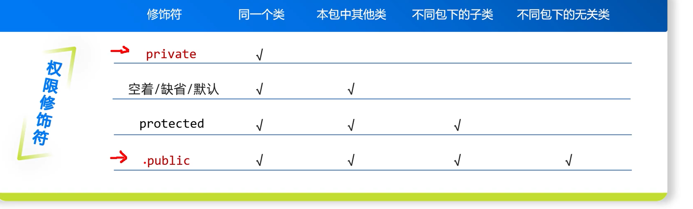

1. Java的引用本质上≈C++指针（安全版、自动版、不能运算的指针），但它完全不是C++的引用（&）
    * 存的都是地址
      * C++ 指针：存对象地址
      * Java 引用：存对象地址
    * 都是间接访问对象：通过指针/引用找到堆里的对象
    * 多个指针/引用可以指向同一个对象
      * C++：int* p1 = &a; int* p2 = p1;
      * Java：Student s1 = new Student(); Student s2 = s1;（new会有两步，第一步是从堆上划分内存，然后将其地址赋给栈上的引用类型s1）
    * 都可以为空
      * C++：ptr = nullptr；
      * Java：ref = null；
    * 赋值都是“改指向”，不是拷贝对象
      * C++： p = q；改指针指向
      * Java： s = t；改引用指向
2. Java引用比C++指针少了什么？（Java只是把指针的危险功能全部删掉了）
    * 不能做指针运算
      * C++：p++、p+1 可以乱跳地址
      * Java：完全不行
    * 不能直接操作内存地址：看不到真实地址，也不能强转
    * 没有多级引用
      * C++：int **p；
      * Java没有引用的引用
    * 不用手动free/delete：JVM自动GC
3. Java 引用 ≠ C++ 引用（&）
    * C++ 引用（int& ref = a）
      * 是变量别名
      * 一旦绑定，终身不能改指向
      * 没有自己的内存空间
      * 不能为空
    * Java 引用（Student s）
      * 是存地址的变量
      * 可以随时改指向别的对象
      * 有自己的栈内存
      * 可以 = null
4. Java的注释语法和C++/C是一样的，用"//"
5. Java里面没有指针的概念，但其引用类型本质是安全指针
6. <mark>Java中的所有引用类型的变量指向的都是对象（Java中一切能new出来的东西，都是对象）（对象≠引用类型变量）</mark>
    ```java
    Student stu = new Student();
   // stu 是引用类型变量，stu指向一个new出来的Student对象
    ```
   Java里除了8种基本类型，剩下的全是对象，全是引用类型
7. 一般是类才有对象的叫法。Java中数组本质也是类，Java数组是JVM内部预先定义好的特殊类，它其实也是class
8. JDK=Java Development Kit，Java开发工具包。专门给程序员写代码用的全套工具。包含三大件：JRE（运行环境）、JVM（java虚拟机）、开发工具（编译、运行、打包、调试等）
    * JVM：java虚拟机（只负责运行.class字节码）
    * JRE=JVM+核心类库（只能跑程序）
    * JDK=JRE+开发工具（写代码+编译+运行）
9. <mark>Java中没有"->"，虽然引用类型是一个地址，通过它访问对象属性，需要用"."，而不是"->"，此时s.id就等价于CPP中的s->id，表示的是s引用指向的对象的id这个成员</mark>
10. Java中的数据类型分类
    * 基本类型：byte/short/int/long/float/double/char/boolean(基本类型不是类)
    * 引用类型：类（String是Java提供的类）、数组、接口、枚举
11. int[] arr = {1,2,3}; 是 int[] arr = new int[]{1,2,3}; 的"简化语法糖"—— 编译器帮你省略了 new int[] 这部分代码，但编译后的字节码、运行时的内存行为，和显式写 new 完全一致，因此数组对象必然在堆上
12. package ByteDance.Learn是声明当前类属于ByteDance.Learn这个包，不是导入包。便于其他类进行导入这个包下的类（当前这个 HelloWorld 类，属于 ByteDance 这个顶级包下的 Learn 子包（包名层级用 . 分隔））
13. Java中栈上的变量：栈内存只存储方法执行期间的临时数据，所有内容都会随方法执行结束自动释放
    * 所有方法内的局部变量（基本类型）：byte/short/int/long/float/double/char/boolean
    ```java
    public void test() {
    int age = 18;      // age（值18）在栈上
    double score = 90.5; // score（值90.5）在栈上
    boolean flag = true; // flag（值true）在栈上
    }
    ```
    * 所有方法内的局部变量（引用类型）:存储堆对象的地址在栈上
    ```java
    public void test() {
     Student s = new Student(); // s（地址值）在栈上，Student对象在堆上
     int[] arr = {1,2,3};       // arr（地址值）在栈上，数组对象在堆上
     String str = "Java";       // str（地址值）在栈上，"Java"常量在堆上
    }
    ```
    * 方法的参数（无论基本/引用类型）
    ```java
    // age（基本类型）、stu（引用类型）都是方法参数，存储在栈上
    public void add(int age, Student stu) {
    // ...
    }
    ```
    * 方法的临时计算值：方法执行过程中临时的计算结果（返回值），会存在栈中
    ```java
    public int sum(int a, int b) {
     return a + b; // a+b的结果（临时值）先存在栈的操作数栈中
    }
    ```
14. Java中堆上的变量：堆内存存储，只有GC能回收
    * <mark>所有对象的成员变量（无论基本/引用类型）：类的成员变量（全局变量）属于对象的一部分，随对象存储在堆上</mark>
    ```java
    class Student {
        // 以下成员变量，随Student对象一起存在堆上
        int age;          // 基本类型成员变量，值存在堆上
        String name;      // 引用类型成员变量，地址存在堆上（String对象也在堆上）
        static String school = "清华"; // 静态变量不在堆上！在方法区（元空间）
    }
   
    // Student对象在堆上，其内部的age、name也在堆上
    Student s = new Student(); 
    ```
    * 所有通过new创建的对象实例：无论普通类、抽象类、接口实现类，只要用new实例化，对象本身必在堆上
    * 所有数组对象（包括基本类型数组）：Java数组是对象，无论存储基本类型还是引用类型，数组本身必在堆上
    ```java
    int[] arr = new int[5];    // 数组对象在堆上，arr是栈上的引用
    String[] strArr = {"a","b"}; // 数组对象+数组内的String对象，都在堆上
    ```
    * 字符串常量池：JDK 1.7 后，字符串常量池从方法区移到堆上，String str = "Java" 的 "Java" 存在堆的常量池中
15. GC:JVM 自动帮你清理堆内存里没用的对象，释放空间，防止内存泄漏、OOM，不用手动free/delete，Java 使用可达性分析判断垃圾，把堆分新生代和老年代，短命对象用复制算法快速回收，长命对象用标记整理回收，自动清理内存避免 OOM，Full GC 会暂停程序
16. <mark>JVM是Java虚拟机，JVM是运行Java程序的虚拟机，JVM是运行Java字节码的虚拟机：你写的 Java 代码（.java 文件）→ 编译成「通用的中间语言」（字节码 .class 文件）；JVM 负责把这个「中间语言」翻译成当前操作系统（Windows/Mac/Linux）能看懂的「本地语言」，然后让系统执行</mark>
17. .java->.class->jvm负责解析字节码、分配内存、创建对象、调度线程执行等。也就是：<mark>你的Java程序=JVM加载字节码后跑起来的业务逻辑</mark>。HSDB就算JVM内置调试工具，直接透视JVM运行态
18. <mark>jhsdb hsdb中hsdb是调试jvm底层的神器，它可以查看jvm运行内存（堆内存、栈内存、对象实例、常量池、方法区全都能看）、查看jvm底层对象架构、死锁排查、查看class字节码、加载情况、分析OOM、内存泄露、看jvm底层指令、本地方法</mark>。Java 程序跑在 JVM 里，HSDB 是钻进 JVM 内部，看你的 Java 代码在虚拟机里变成了什么、怎么存、怎么跑
19. JVM核心作用 
    * 跨平台（Java最核心的优势）：C/C++ 程序：编译后直接生成「操作系统专属的可执行文件」（Windows 是 .exe，Linux 是 .out），换系统就不能用；Java 程序：编译后生成「字节码（.class）」（跨平台的通用格式），只要对应系统装了 JVM，就能运行这个字节码 
    * 内存管理
        * 自动分配内存：划分栈、堆、方法区、程序计数器、本地方法栈五大内存区，规范所有 Java 程序内存使用。比如创建对象/数组时，JVM自动在堆上分配内存
        * 自动回收内存：GC是JVM的核心组件，会自动清理不再使用的对象，释放堆内存（不用像 C++ 那样手动 delete/free）
        * 避免内存泄露：只要 JVM 正常工作，开发者基本不用关心内存回收的问题
    * 类加载机制和链接：负责加载、验证、准备、解析、初始化.class文件，把代码变成可运行数据
    * 安全校验（防止恶意代码）：
        * JVM 执行字节码前，会通过「类加载器 + 字节码校验器」做层层检查：
        * 检查字节码是否合规（比如有没有非法内存访问）；
        * 限制程序的权限（比如不能随意访问操作系统的底层资源）；
        * 避免恶意代码破坏系统，让 Java 程序更安全
    * 执行字节码
       
20. <mark>java程序的完整执行流程：</mark>
    * 编译：.java 源码 → javac 编译 → 生成 .class 字节码文件
    * JVM启动：`java 类名`命令，启动 JVM 虚拟机进程
    * 类加载：把硬盘上的 .class 字节码，读到内存方法区
    * 链接：验证（检查字节码是否合法、安全）、准备（给方法区static 静态变量 分配内存、赋默认初始值（0、null、false））、解析（把符号引用改成直接内存地址引用）
    * 初始化：执行静态代码块、静态变量显示赋值，给静态变量赋程序员写的初始值，这是类加载最后一步，只执行一次（枚举对象就是在这创建的，只会初始化一次，天然线程安全）
    * 进入程序入口：找到main方法，创建主线程，开始逐行执行代码
    * 运行
    * 结束
21. JVM启动、类加载、链接、初始化这几个步骤是JVM负责执行的
22. <mark>Java编译(.java文件)=>字节码文件（.class 文件）=>JVM运行字节码</mark>
23. 编译期：编译阶段；运行期：其余部分
24. JDK11引入了一个便捷特性：`java Main.java`可以直接运行`.java`文件，无需先`javac`编译，但这个不是跳过编译，而是JVM会在内存中临时编译生成`.class`字节码，运行完成后，临时生成的`.class`文件会被销毁。本质还是“编译->运行"，只是编译过程被JVM隐式执行了，没有最终在硬盘上保存`.class`文件
25. JVM的内存区域是在JVM一启动就创建好的，但是各个区域里存放的具体数据（类信息、对象、栈帧）：是在类加载、线程运行、方法调用时才陆续创建、放进去的
26. JVM内存模型：栈、堆、本地方法栈（Native 方法（底层 C/C++）的执行数据（栈帧、局部变量））、程序计数器（记录当前线程执行的字节码行号，Native 方法时为 undefined，记录线程执行位置，支持线程切换）、方法区（元空间）
    * 栈、本地方法栈、程序计数器是线程私有（每个线程都有自己的这些内存区域）的
    * 堆、方法区是线程共享（多个线程共享的这些内存区域）的
27. Java 中有些方法是用 C/C++ 实现的（比如 System.currentTimeMillis()、Object.hashCode()），这些方法被称为「Native 方法」（方法名带 native 关键字）
28. 方法区（JDK8之后是元空间实现的，之前是永久代实现）：
    * 类的元数据：如类名称、父类名称、实现的接口列表、类的访问修饰符等
    * 方法/字段（成员变量）信息：类中所有方法的字节码、参数列表（参数数量、参数类型、参数顺序，这里不是调用时栈上具体的值）、返回值类型、访问修饰符；所有字段（成员变量）的名称、类型、访问修饰符；
    * 静态变量：类的静态变量本身（比如 static String school = "清华"），注意：静态变量指向的对象（如 "清华"）仍在堆中，school引用变量本身在方法区
    * 运行时常量池：存的是编译器就能确定的常量信息（如整数常量、布尔常量等等，字符串符号（不是字符串对象，JDK8之后的字符串常量对象在堆中））
29. 类加载是 JVM 将类的元数据加载到方法区的过程，是 “准备阶段”，不创建对象； 类实例化是基于已加载的类，在堆中创建对象的过程； 类加载是实例化的前提，但类加载后可以不实例化（比如仅使用静态成员），一个类只加载一次，但可实例化多次
30. Java中的常量池
    * class文件常量池：.java 编译成 .class 后，文件内部自带的一张常量表。不存在内存中，只是文件数据。 编译时生成，存在 .class 文件里
    * 运行时常量池：方法区中 
    * 字符串常量池：堆里
31. 变量是存储数值的空间，而不是那个数值
32. `public static void main(String[] args)`解释：
    * public：保证 JVM 能访问到这个方法（java25之后就不需要写了）
    * static：JVM无需创建对象就能调用方法。static 让 main 方法属于「类本身」，而非类的对象；JVM 启动程序时，只需加载类，无需 new 类名() 创建对象，就能直接调用 main 方法
    * void：main方法不需要返回值给JVM。Java 官方规定入口方法返回 void
    * String[] args：接收命令行传入的参数（类似CPP（`int main(int argc, char* argv[])`（argv是一个指针数组，这个数组的每一个元素都指向一个字符串，这和String[] args中的每一个元素类似））、python等）。String[] 是字符串数组，args 是参数名（可自定义，比如改成 String[] params），用于接收程序运行时从命令行传入的参数。命令行传入的参数都是文本形式。在Java25后放宽了标准，String[] args不是必须的，可以省略不写，如果不用的时候就可以不写
    * args的每一个元素都是引用类型
33. <mark>`final`关键字：可以修饰变量、方法、类</mark>
    * 修饰变量时(此时就可以将其称作常量了)：赋值后不可再修改（基本类型值不可改，引用类型指向不可改）。此时一般会对常量名大写，多个单词之间用下划线隔开
    ```java
    class Student {
        public Student(String name) {
        }
        String name;
        final int A = 10;
        final Student S = new Student("张三");
        static void main(){
          
        }
        public void test() {
            A = 20; // 编译报错：final变量不可重新赋值
            System.out.println(S.name);
            S = new Student("李四");// 报错：引用指向不能改
            S.name = "王五";// 正确，可以修改对象属性值
        }
    } 
    ```
    * 修饰方法时：方法不能被重写
    ```java
    class Parent {
        // final方法：不可被重写
        public final void sayHello() {
            System.out.println("父类的hello");
        }
    }
    class Child extends Parent {
         @Override
         public void sayHello() { // 编译报错：不能重写final方法
                 System.out.println("子类的hello");
         }
        // 合法：可以重载（参数列表不同）
        public final void sayHello(String name) {
            System.out.println("hello " + name);
        }
    }
    ```
    * 修饰类时：类不能被继承，并且里面的所有方法不能被重写
    ```java
    final class FinalClass {}
    class SubClass extends FinalClass {// 错误，不能继承final类
    }
    ```
34. <mark>`final`修饰变量时初始化：</mark>
    * 局部final变量（方法里）:此时可以先声明、后赋值，但必须在使用前赋值，且只有一次
    ```java
    public void test() {
        final int a;
        // 可以先不赋值
        a = 10; // 第一次赋值，合法
        a = 20; // ❌ 报错，不能二次修改
    }
    ```
    * 成员final变量，此时必须初始化，要么是定义时直接赋值，要么在构造方法里赋值。一个新对象就会创建一个新final变量，因此只要调用一次构造方法实例化对象就保证final变量只初始化一次
    ```java
    final int age = 18;
    
    final int age;
    public Student() {
        age = 18;
    }
    ```
    * static final常量，此时定义时直接赋值，此时不能在构造方法中赋值，因为static final属于类本身，类加载时就要初始化
35. <mark>Java和CPP对于类的默认实例化的区别：</mark>
    * `Student s1;`：对于java，此时不会调用（默认）构造方法、不会实例化对象、不会new任何东西，此时只是在栈上创建了一个引用变量s1，系统自动给默认值null。只有`student s1 = new Student();`才会调用无参构造
    * `Student s1;`:对于CPP，会直接实例化对象，自动调用默认无参构造，此时s1就是一个实例化对象了
36. <mark>java普通类（除了枚举类）不能用隐式创建来实例化对象，必须用new关键字来实例化对象，而CPP是可以直接隐式实例化的，此时它就是栈上的对象</mark>。java里只有枚举才能隐式实例化：
    ```java
    enum Gender{
        MALE(1,"男"),// 隐式实例化，等价于public static final Gender MALE = new Gender(1,"男");
        FEMALE(2,"女");
        // 构造
        private Gender(int code, String name) {}
    }
    ```
37. <mark>java的类实例化必须有小括号，就算是调用无参构造函数也必须有；而cpp在调用无参构造的时候可以不写小括号。如：</mark>
    ```java
    class Student {}
    Student stu = new Student();
    ```
    ```cpp
    class Student {}
    Student stu;
    ```
38. java的访问修饰符（有四类）：
    * 类：放在class关键字前：`public class ClassName {}`
    * 方法：放在方法返回值前：`public static void main(String[] args) {}`
    * 成员变量：放在变量类型前：`public int a;` 
39. CPP的类本身没有访问修饰符
40. 四类访问修饰符(public > protected > 默认 (包权限) > private)
    * 无修饰符（默认）：包访问权限（package-private），仅对同一个包内的类可见，不同包的子类也不可以访问(哪怕有继承关系、是子类，照样访问不了)。可以用于：类、方法、成员变量
    * public：公共权限，所有包的所有类都可见。可以用于：类、方法、成员变量
    * protected：受保护的权限，同一个包内 + 处于不同包的子类可见，不同包的无关类不能访问。可以用于：方法、成员变量，类不能用
    * private：私有权限，仅对当前类内部可见，当前类外部不能直接访问。可以用于：方法、成员变量。外部类不能用private修饰。private可以修饰内部类,如:
    ```java
    class Outer {
        private class Inner {}    
    }
    ```
    
    <mark>`C++`和`java`一样，它们的`private`私有变量不能在类的外部被直接访问,常见的只能通过该对象的方法(`getXXX()/setXXX()`)来间接访问或修改</mark>
41. <mark>一个java文件，只能有一个public类（类名和文件名一致），其余类只能用默认修饰符</mark>
42. <mark>类的访问权限可以低于成员变量/成员方法，在语法上没问题，但是要使用这个变量或者方法，肯定要通过类的对象来访问，所以至少要先能访问到这个类才行，不管是不是static都一样，对于static也需要先访问到类才行。因此，实际开发中类的访问权限需要≥类的成员变量/方法的访问权限</mark>
43. 类修饰符只是表示这个类本身能被访问的权限，并不是表示该类内的成员/方法的权限
    ```java
    package com.example.package1;
    public class Parent {// public 修饰类，仅表示这个类本身能被所有包访问，并不会 “自动继承” 给类内的成员变量/方法 
    // 包访问权限：仅同包可见
    String defaultField = "默认权限字段";
    // protected权限：同包 + 不同包子类可见
    protected String protectedField = "受保护字段";
        // 包访问权限方法
        void defaultMethod() {
            System.out.println("默认权限方法");
        }
        // protected权限方法
        protected void protectedMethod() {
            System.out.println("受保护方法");
        }
    }
    ```
    ```java
    // 不同包的子类
    package com.example.package2;
    import com.example.package1.Parent;
    public class Child extends Parent {
    public void test() {
        // 方式1：通过子类对象访问自身继承的protected成员（推荐）
        System.out.println(this.protectedField); // ✅ 不同包子类
        this.protectedMethod();                  // ✅ 不同包子类
        // 方式2：直接访问（等价于this）
        System.out.println(protectedField);      // ✅
        protectedMethod();                       // ✅
        // ❌ 错误：不同包下，不能通过父类对象访问protected成员
        Parent parent = new Parent();
        // System.out.println(parent.protectedField); // 编译报错
        // parent.protectedMethod();                  // 编译报错
        // ❌ 错误：默认权限，不同包（即使是子类）也无法访问
        // System.out.println(this.defaultField);     // 编译报错
        // this.defaultMethod();                      // 编译报错
    }
    }
    ```
    不同包的子类中，仅能通过子类自身的对象（this/ 子类实例）访问 protected 成员，不能通过父类对象访问。因为如果允许子类可以通过父类对象访问protected成员的话，那么任何其它和父类没有任何关系的类豆科鱼通过子类间接访问父类的protected成员，从而违背了该访问权限的设计
44. 方法内的局部变量是不能用访问修饰符的，因为访问修饰符（public、protected、private）只对类成员变量/类/方法有效。局部变量仅在方法内有效，无访问权限的概念
45. `static`也不可以修饰局部变量，局部变量是方法级别的临时变量，属于线程私有，和类无关。`static`修饰的是类级别的成员方法/成员变量/内部类；`final`可以修饰局部变量
46. static 不能修饰外部类（顶级类），但可以修饰成员内部类，成员内部类是外部类的成员，称为静态内部类，static 可将其绑定到外部类本身（而非外部类的对象）
    ```java
    // 外部类（不能加static）
    public class Outer {
    // 静态内部类（static修饰成员内部类，合法）
        public static class StaticInner {
            public void innerTest() {
                System.out.println("静态内部类的方法");
            }
        }
        // 非静态内部类（无static，默认访问权限）
        public class NonStaticInner {
            public void innerTest() {
                System.out.println("非静态内部类的方法");
            }
        }
        static void main(String[] args) {
            // 1. 静态内部类：直接通过外部类名创建对象（无需外部类对象）
            Outer.StaticInner staticInner = new Outer.StaticInner();
            staticInner.innerTest();
            // 2. 非静态内部类：必须先创建外部类对象，再创建内部类对象
            Outer outer = new Outer();
            Outer.NonStaticInner nonStaticInner = outer.new NonStaticInner();
            nonStaticInner.innerTest();
        }
    }
    ```
47. 修饰符 public 对于 Java 25 的 main 方法是冗余的。因为此时JVM也能正常识别并执行它，因此public修饰符不再是必需的
48. Java中不能在方法内再定义方法。方法内可以定义局部内部类，但是局部内部类仅在方法内可见，无访问权限的概念，static也不可以用。此时只可用final和abstract（定义抽象局部内部类（需子类实现））
49. Java没有结构体
50. Java的一条语句可以定义多个变量，也可以连续赋值
51. 计算机中，任意数据都是以二进制的形式化存储的
52. Java中的long类型数据必须以L结尾，可以是大写，也可以是小写；float类型必须以f或者F结尾
53. Java不支持在类外部定义变量/函数/代码块等。因为Java是一门纯面向对象的变成语言，设计理念是一切皆对象/类，所有的程序逻辑、数据都必须封装在类或接口中（这和CPP不同，CPP中是支持全局变量的）
54. Java规定：所有独立运行的Java程序，必须从public static void main(String[] args)开始运行
55. Java数组是对象，CPP数组本质是一段连续内存+指针常量。Java的定义是[]跟在类型后；CPP是[]跟在变量名后。需要注意：<mark>java中数组定义左边只写类型，不能写长度，左边至少一个声明一个引用类型变量，只是一个引用标签，本身不存数据，因此不能写长度</mark>
    ```java
    // 推荐写法
    int[] arr;
    int[] arr = new int[5];
    int[] arr = {1,2,3};
    // 也能写但不推荐
    int arr[];// cpp是这样的
    ```
56. Java的标识符命名规范
    * 由数字、字符、下划线、美元符组成
    * 不能以数字开头
    * 不能是关键字
    * 区分大小写
57. Java不需要像CPP那样手动写析构函数，因为Java有字段垃圾回收机制(GC)
58. 如果一个Java文件中有两个类（但是只能有一个public类），那么在文件视图显示时会把两个类都显示出来，注意这不是有两个java文件。编译时，Java 编译器会为每个类生成独立的 .class 文件，可以在输出目录（out/）中看到
59. 在Java中，同一个文件夹、同一个包下的类，不需要import，直接用就行
60. 企业开发中大多都是一个类对应一个java文件
61. 输出方式：
    * System.out
      * System.out.print():不换行。也可以直接在输出的时候用`+`进行字符串相加，如:`System.out.print(j+"*"+i+"="+j*i+" ");`
      * System.out.println():换行。如：System.out.println("hello "+value):左边是固定字符串，右边是变量，Java会自动把它们连成一个完整字符串再输出
      * System.out.printf():格式化输出(类似C)
      * C/CPP中可以直接逗号分割输出，`printf(a,b)`；java是不支持这样的
62. 输入方式：
    * Scanner
      * sc.next()：读取一个字符串（不含空格）
      * sc.nextInt()：读取一个整数
      * sc.nextLine()：读取整行（包含空格）
      * sc.nextDouble()：读取一个double
      * sc.nextBoolean()：读取一个布尔值
      * sc.nextFloat()：读取一个float
      * sc.nextLong()：读取一个long
      * sc.nextByte()：读取一个byte
      * sc.nextShort()：读取一个short
      * sc.nextBigInteger()：读取一个BigInteger
      * sc.nextBigDecimal()：读取一个BigDecimal
      * sc.hasNext()：判断是否还有下一个输入
      * sc.hasNextInt()：判断是否下一个输入是否为整数
      * sc.hasNextDouble()：判断是否下一个输入是否为double
      * sc.hasNextLine()：判断是否下一个输入是否为整行
      * sc.hasNextBigInteger()：判断是否下一个输入是否为BigInteger
      * sc.hasNextBigDecimal()：判断是否下一个输入是否为BigDecimal
    * BufferedReader（适合读取整行）：
      ```java
        BufferedReader br = new BufferedReader(new InputStreamReader(System.in));
        System.out.print("请输入一句话：");
        String line = br.readLine(); // 读取一整行
      ```
    * 文件输入输出：
      * FileWriter
      * FileRReader
63. System.in是标准输入流，即键盘
64. BufferedReader：是 Java IO 流中用来高效读取字符流的类，主要用来从控制台、文件、网络流等地方读取文本，特点是带缓冲区、读得快、支持按行读取
    * 这个类有着独有的方法readLine()，一次读一行，也可以read()一个字符一个字符的读
    * BufferedReader br = new BufferedReader(new InputStreamReader(System.in))
      * System.in是标准输入流
      * InputStreamReader：将键盘的字节流转换为字符流
      * BufferedReader：给字符流加缓冲，支持 readLine()
        ```java
        import java.io.BufferedReader;
        import java.io.InputStreamReader;
        public class Test {
        public static void main(String[] args) throws Exception {
        // 创建对象
        BufferedReader br = new BufferedReader(new InputStreamReader(System.in));
        System.out.print("请输入一行内容：");
        String line = br.readLine();
        System.out.println("你输入的是：" + line);
        br.close();// 关闭流，释放资源
        }
        }
        ```
    * 对比Scanner
      * Scanner适用所有类型，但是慢，如果一个大的文本文件，那么就需要大量io才行
      * BufferedReader快，并且readLine()好用，但是只能读字符串，需要自己转类型：BufferedReader使用了缓冲区，它一次性读一大块放进内存缓冲区，后面只需要每次从内存中取就行，而不需要每次都去通过磁盘或者键盘读取，内存的速度是快好几个数量级的
65. Java和CPP一样，整数相除得到的还是整数，会自动向下取整
66. System.out.println()不支持直接用逗号分割多个字符串拼接参数，它只接收一个参数
    ```java
    // 错误：println 只能接收一个参数，不能用逗号分隔多段文本
    System.out.println("小时是：" + hour, "分钟是：" + min, "秒是：" + sec);
    // 修改
    System.out.println("小时是：" + hour + " 分钟是：" + min + " 秒是：" + sec);
    System.out.printf("小时是：%d, 分钟是：%d, 秒是：%d%n", hour, min, sec);
    ```
67. 数字运算：类型不一样不能运算，需要转成同类型的才能计算
68. Java的隐式转换是从小到大转换，类型的取值范围：byte<short<int<long<float<double。Java的隐式转换：
    * 自动进行转换的，会默认进行的
    * 如果有byte、short类型的数据，会先提升为int类型
    * 把取值范围小的提升为取值范围大的，再进行运算
    ```java
    byte a = 10;
    byte b = 20;
    int c = a + b;
    ```
69. Java的强制转换(有可能会丢失精度)：强制转换不会自动触发，需要手动书写代码。格式为：目标数据类型 变量名 = (目标数据类型)被强制转换的数据;
70. 大写字符->小写字符，用运算实现：char cc = (char)(c+32);// 必须要用强制类型转换，不然右边就是int类型
71. 字符串只有+操作，即拼接操作，没有其它操作。任意数据+字符串都是拼接操作，并产生一个新的字符串：10+8+"岁"->"18岁";10+8+"岁"+1+2->"18岁12"(后面1,2有左操作数是字符串所以说拼接)
72. 三元运算符（条件表达式）：条件 ? 运算1 : 运算2
73. <mark>Java中的boolean和int之间不能隐式转换也不能强制转换，这和CPP不同</mark>
    ```java
    // 下面这是错的
    int num;
    Scanner sc = new Scanner(System.in);
    num = sc.nextInt();
    while(num) {...}
    // 下面也是错的
    int i = 1;
    if(i) {...}
    ```
74. 为什么值传递形参的修改不对实参产生影响?
    形参是独立的新变量，和实参只是值一样，不是同一个内存地址，所以改形参，完全碰不到实参
75. <mark>Java只有值传递，和CPP不一样（CPP有引用传递）。Java中想在方法里修改、让外面也生效：</mark>
    * 传数组(也是引用类型)、自定义对象（引用类型）。java虽然只有值传递，但是传引用类型时，传的不是对象本身，而是对象地址的副本，此时是同一个地址
    ```java
    class Person {
        int age;
    }
    public static void setAge(Person p){
        p.age = 20;
    }
    public static void main(String[] args) {
        Person p = new Person();
        setAge(p);
        System.out.println(p.age); // 20 生效
    }
    ```
    * 方法return新值，外面接收赋值
76. 调用方法其实就是实参给形参赋值，基本类型是传值的副本，引用类型是传地址的副本