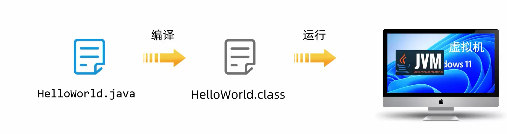
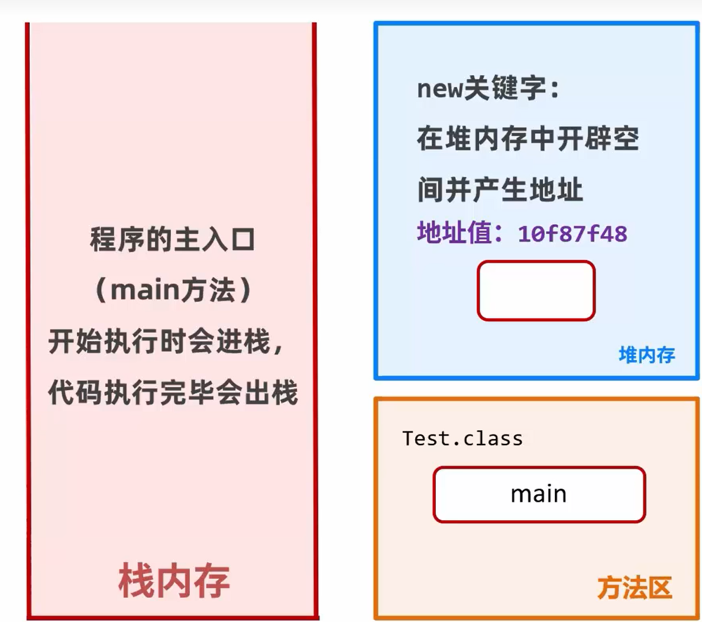
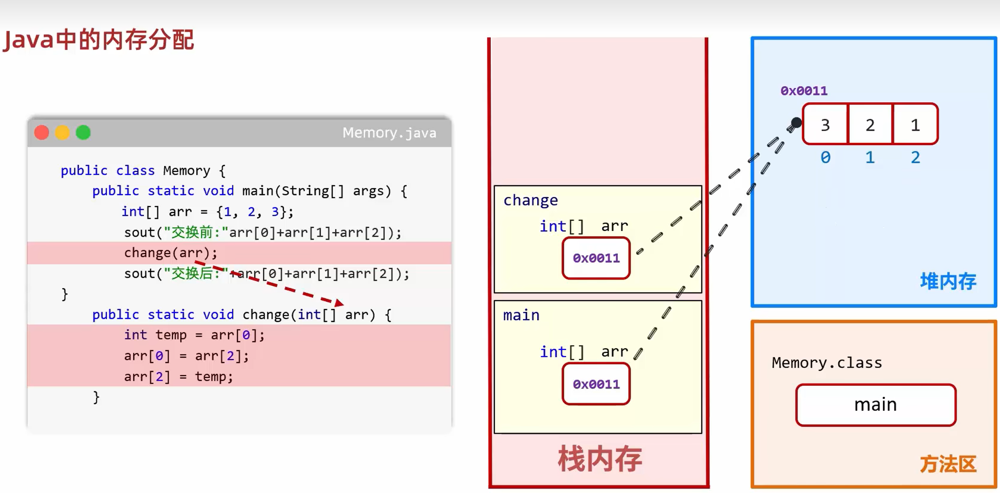
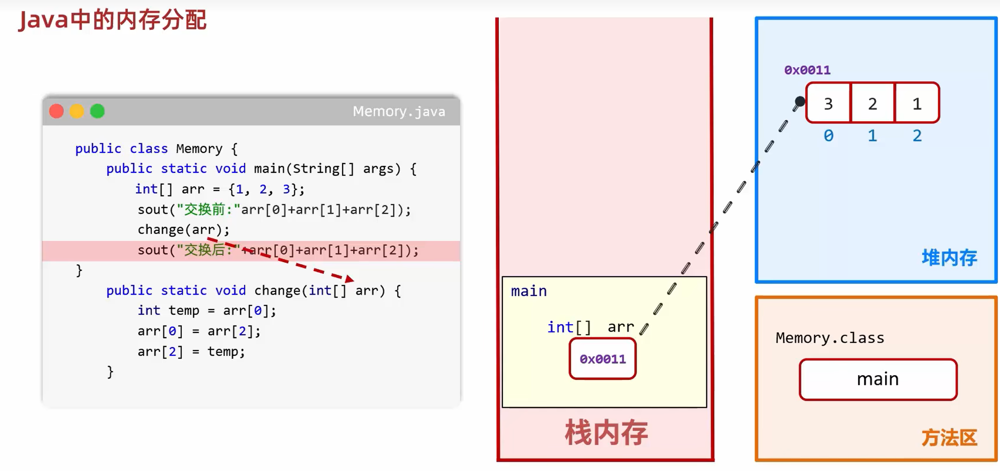
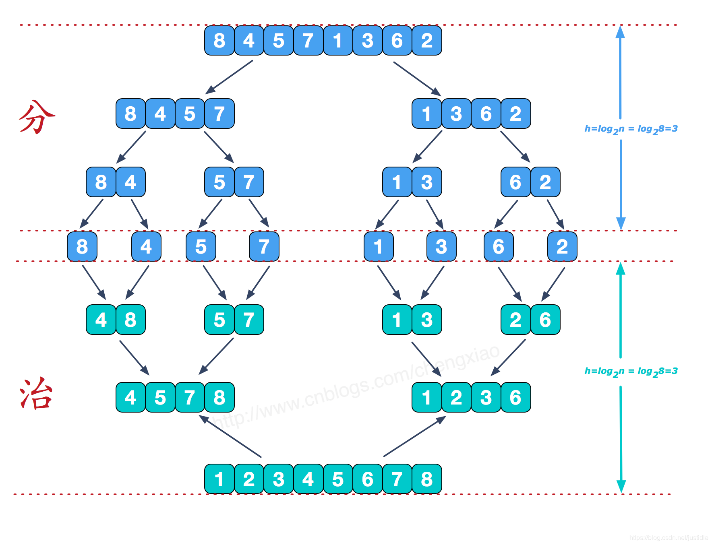

1. Java的运行机制
    * Java文件->class字节码文件->JVM运行
    * java是运行在虚拟机的，不是直接运行在操作系统的
    * 虚拟机可以实现跨平台
   
2. 内存：软件在运行时，用来临时存储数据的
3. 一个字节是内存最小寻址单元
4. 内存地址是内存中每一小格子的地址，每一个小格子就是一个字节
5. java的内存分配
    * 栈内存：每个线程都要自己独立的栈，方法被调用进栈执行，执行完毕出栈
    * 堆内存：所有线程共享，存储对象、数组、字符串常量池。用了new关键字就用到了堆内存，它会在堆内存中开辟空间并产生地址
    * 方法区：JDK7永久代实现，JDK8+元空间实现，从虚拟机内部移到本地内存。存储字节码信息、常量、静态变量
   
    * 本地方法栈：调用本地Native方法
    * 程序计数器：每个线程独立、记录当前线程执行的字节码指令地址（行号）
6. java中的内存分配
   
   
7. 归并排序：分治思想
   
8. <mark>泛型类：带“类型占位符”(T)的类。不把类型写死，同一个类，可以装任意不同类型</mark>
9. <mark>java的泛型类≈CPP的模板类。需要注意的是：</mark>
   * CPP模板类：`template <class T> class 类名{}`;Java泛型类：`class 类名<T>{}`
   * 泛型类如果不加`<>`指定类型，编译不报错，仅弹出黄色警告，比如`List<Object>`：默认存放所有类型，但是很不推荐
   * C++的模板类会在编译时按需生成多份真实代码，vector<int> 生成一份 int 版源码；vector<string> 生成一份 string 版源码；类型在运行时完全保留，没有擦除
   * Java泛型编译后把`<T>`全部抹成`Object`，运行时根本不知道传的是`Integer`还是`String`，只是编译期做类型检查，运行时泛型消失了，这就是泛型擦除
   * 因为Java泛型会在编译后抹成`Object`类型，而基本类型不能向上转`Object`,因此泛型只支持引用类型
   * 泛型类语法要求必须带`<>`，左边有尖括号，右边也要有。泛型类实例化，必须保留尖括号，哪怕里面空着也不能删括号
   * 对于泛型类实例化，右边`<>`是JDK7钻石语法，可以省略重复类型，只留壳。如：`ArrayList<Integer> list = new ArrayList<>();`
10. <mark>`Object`：它是Java中所有类的祖宗类，所有类（包括自定义）都是默认全部直接或间接继承子`Object`。`Object`类型(Object是引用类型)变量，可以接收任何对象</mark>
11. 数组类型的长度是固定的，不能改变，因此为了实现自动扩容就出现了`ArrayList`集合类
12. CPP中如果需要实现数组自动扩容，即一开始不知道数组大小，可以用vector。java中用`ArrayList`平替，但是需要注意
    * `ArrayList`是一个泛型类
    * `ArrayList`只能装引用类型，不能装基本类型。`ArrayList<int>`是错误的，必须是`ArrayList<Integer>`或`ArrayList<int[]>`或`ArrayList<Double>`等
    * 和vector一样，`ArrayList`底层是普通数组，自动扩容原理和vector一样。查改快、中间插入删除慢
    * `ArrayList`是动态数组，自动扩容，不用自己管长度，可以随时增删
    * `vec.push_back(20);`<=>`list.add(10);`;`list.add(new int[]{i, arr[i]});`
    * 定义方式：`ArrayList<int[]> maxList = new ArrayList<>()`(初始size=0)
    * `ArrayList<Integer> list = new ArrayList<>(20);`:预先给底层数组分配空间，不限制最终长度，只是减少扩容次数,此时的size还是0
    * 初始化：
      * `ArrayList<Integer> list = new ArrayList<>(List.of(1,2,3,4,5));`
      * `ArrayList<Integer> src = new ArrayList<>();src.add(1);src.add(2);`
      * 拷贝构造：`ArrayList<Integer> list = new ArrayList<>(src);`
13. `List.of()`是java 自带的、快速创建一个不可变固定列表的工具方法，它返回一个只读、不可修改的List(长度固定)，就是一次性写死的列表，虽然它可以用来给ArrayList初始化，但是不代表这种初始化方法的ArrayList就不是动态扩容了。`ArrayList<>(List.of ())` = 快速生成一个可修改的 ArrayList
14. `ArrayList<Integer> list = new ArrayList<>( List.of(1,2,3) );`，分为两步：
    * List.of(1,2,3) → 生成只读、固定的临时集合
    * new ArrayList<>(临时集合) → 把临时集合里的元素全部复制一份，放到全新的 ArrayList 可修改容器里。因此，不是把原对象（`List.of()`生成的还是不可修改的）变成可修改，而是复制了一份到新的可修改对象。
15. java没有pair类的替代，cpp中可以`vector<pair<int, int>>`,但是java中如果要实现pair必须自己定义类。可以用`ArrayList<int[]>`来代替使用
16. `Deque`是Java接口，即能当队列用，也能当栈用。`Deque`是接口，所以不能new，需要用`Deque`的实现类来new，`Deque`的实现类有：`ArrayDeque`、`LinkedList`、`ConcurrentLinkedDeque`
17. <mark>java中有传统`Stack`类，它继承子vector，老旧，线程安全、性能差，不推荐，可以用`Deque`来充当栈用，此时`push()/pop()`都是操作这个双端队列的头部，即相当于操作栈了</mark>
18. `Deque`做栈时：
    * `push`
    * `pop`
    * `peek`
    * `isEmpty`
19. `Deque<Integer> stack = new ArrayDeque<>();`这和CPP中的向上类型转换（自动进行）是一样的，父类的引用可以直接指向子类对象
20. 为什么使用`Deque<Integer> stack = new ArrayDeque<>();`定义栈，而不是`ArrayDeque<Integer> stack = new ArrayDeque<>();`?
    后者也是可以的，此时也是可以直接用`push/pop/peel/isEmpty`，但是行业中更通用面向接口来写，因为这样更灵活，假如你一开始用 ArrayDeque 做栈， 以后想换成 LinkedList 做栈： 如果左边是 Deque（接口），只改右边就行