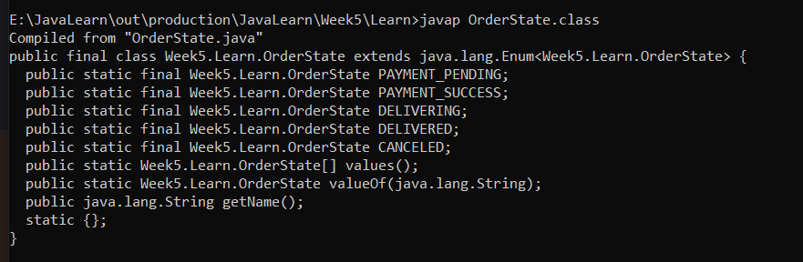

1. 对象：把相关的数据和方法组织为一个整体来看待
2. 面向对象：利用对象进行软件开发
3. 标准Java项目结构（其它语言是类似的）
    * 单独一个主类，只负责放 main 方法（其实就是调用它的地方（上游服务），可能是上游服务、测试代码等）
    * 其他所有类只写功能、不写 main
    * 其他类只写：属性、方法、功能逻辑
4. 同一个目录下的java中的类是可以不用import，而是直接使用的
5. 描述一类事务的类叫JavaBean类，Javabean类可以写属性和方法。Javabean类的属性不能是static。标准JavaBean类要求私有化成员变量，并且提供getter和setter方法、构造方法、其它成员方法
6. 带有main方法的类叫测试类
7. <mark>类中对于私有成员变量，一般都需要写对应的`public`的`set/get`方法</mark>
8. 使用变量，会使用就近原则，先在方法中看是否有局部变量，如果没有才会去看成员变量，重名时就会用this引用
9. 如果要在方法内部明确使用成员变量，可以加`this`前缀，比如
   ```java
    public void setName(String name) {
        this.name = name;
    }
   // 如果局部变量和成员变量不重名，在方法中就可以不用this
   public Student(String name, int age, double height, double weight) {
        name_ = name;
        age_ = age;
        height_ = height;
        weight_ = weight;
    }
   // 重名就加this
   public Student(String name, int age, double height, double weight) {
        this.name = name;
        this.age = age;
        this.height = height;
        this.weight = weight;
    }
   ```
10. java中this和CPP的this本质都是指向当前实例对象的自身引用/指针。都代表当前正在调用这个方法的对象，都用来区分成员变量和局部变量重名。静态方法不能用this，因为静态方法不属于某个实例对象，而是属于这个类（没有对象就没有this）
11. 如果没有自定义构造方法，那么系统会给出一个默认的无参构造方法
12. 如果自己写了任意构造方法，系统将不再提供默认构造方法。如果自定义了有参构造，那么初始化时就不能无参构造了，因此此时没有无参构造方法了
13. 以后无论是否使用，都手动书写无参构造方法，和带全部参数的构造方法
14. 注意：<mark>`java`不支持方法/构造器默认参数值,CPP支持默认参数</mark>
   ```java
   // Java 非法！
   public void show(int a, int b = 10) {
   }
   ```
15. static表示静态，是java的修饰符，用来修饰成员变量/成员方法
    * static修饰成员变量的叫做静态变量，被该类所有对象共享。赋值静态变量时，推荐直接使用`类名.变量名`
    * static修饰成员方法的叫做静态方法，不需要创建对象就可以调用
    * 静态变量是随着类的加载而加载的，优先于对象出现的，不随对象创建而创建，只会加载这一次
    * 静态变量存在方法区，不属于对象，属于类
    * 静态方法只能访问静态变量和其它的静态方法，不能访问普通成员变量、普通成员方法
    * 非静态方法可以访问静态变量或静态方法，也可以访问普通成员变量、普通成员方法
    * 静态方法中没有this关键字
    * static修饰的静态方法多用在测试类和工具类(util文件夹下,工具类一般会私有化构造，然后工具方法用static修饰)中，调用方法还是推荐直接使用`类名.方法名` 
16. static不能修饰外部类，和private类似，可以修饰内部类，如：
    ```java
    class Outer {
    // ✅ 合法：静态内部类
    static class Inner {
    
        }
    }
    ```
17. <mark>CPP中不 new 默认栈上（就算是类对象等，只要没明确new-delete管理，都是栈上），new 才是堆；Java 无论怎样对象都在堆</mark>
18. <mark>java中实例化一个对象时的执行顺序：</mark>
    * 父类静态代码块 / 静态变量初始化（仅第一次加载类时执行）
    * 子类静态代码块 / 静态变量初始化（仅第一次加载类时执行）
    * 父类实例成员变量初始化 + 父类构造代码块
    * 父类构造方法
    * 子类实例成员变量初始化 + 子类构造代码块
    * 子类构造方法
19. <mark>实例成员变量的初始化（包括显式赋值和构造代码块），会在构造方法体之前执行</mark>
20. 构造代码块是直接在类里写一对对立大括号，没有static、没有方法名。构造代码块在每一次实例化对象时都会比构造方法先执行，不管调用哪个构造方法（有参、无参），都会自动先执行构造代码块（和成员变量初始化是一起的，在执行构造方法之前）。它的作用是：把所有构造方法都要共用的重复代码，抽出来放到构造代码块里，便于管理
   ```java
   class Student {
       String name = "张三";
   
       // 构造代码块
       {
           System.out.println("构造代码块：" + name);
       }
   
       // 构造方法
       public Student() {
           System.out.println("构造方法：" + name);
       }
   }
   ```
21. 下面代码会导致栈溢出，创建对象无限递归导致的：
   ```java
   public class Demo3 {
       public Demo3(String name) {
       }
       String name;
       final int A = 10;
       final Demo3 S = new Demo3("李四");
       static void main() {
           Demo3 demo3 = new Demo3("张三");
           demo3.get();
       }
       public void get() {
           System.out.println(S.name);
           S.name = "王五";// 正确，可以修改对象属性值
       }
   }
   ```
22. <mark>java中常量一般格式是`public static final 数据类型 常量名 = 值;`，`public`和`static`可以看情况而定（但通常是`public static`结合）。虽然java保留了const，但是不能用来定义常量，只是闲置废弃了</mark>
23. 枚举是一个特殊的Javabean类，即一个特殊类。这个类的对象是有限个（比如：星期几、订单状态等等），其定义格式为：
    ```java
    public enum 枚举类名 {
        // 枚举类第一行要写这个类所有可能的对象
        枚举对象名1, 枚举对象名2, 枚举对象名3;
        属性
        方法
    }
    ```
24. java的枚举类：
    * 构造默认私有，不能public
    * 枚举类对象是实际上都是`public static final`常量，就算没写，JVM也会自动加上，因此其实是枚举常量
    * 枚举类对象的访问:`枚举类名.枚举类对象`
    * 底层自动继承 java.lang.Enum
    * 枚举类的第一行上必须是枚举项，枚举项之间用逗号隔开，以分号结束
    * 编译器会给枚举类新增两个默认存在的方法：`valuse()、valueOf()`
    * 每一个枚举项都是该枚举类的对象，每一个对象都是通过构造方法创建的，并且都是一个天然的单例对象（构造方法私有、全局唯一静态实例，不能被外部创建、不能被复制）
    * 在java中，枚举对象可以直接用隐式构建方法，不需要显示指定new
    * values();表示获取本类所有枚举对象
    * valueOf(String name);传入的name是枚举对象名称，表示获取指定枚举对象
25. 反编译一个枚举类，观察如下：
    
26. 对于权限修饰符，static 和 final 没有先后逻辑语义区别，编译器两种都能过，但编码规范强制：static 写在 final 前面.Oracle规范统一`public static final`的固定顺序