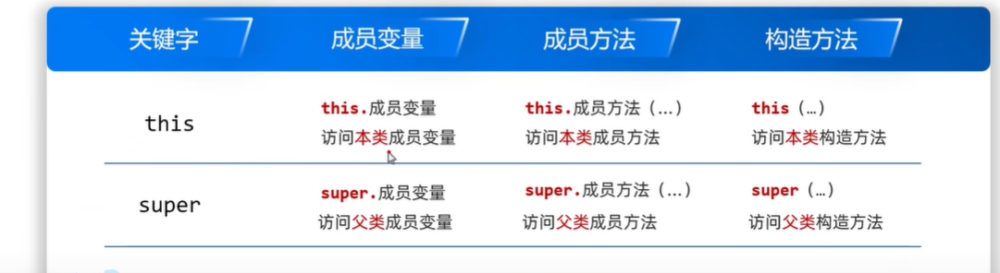
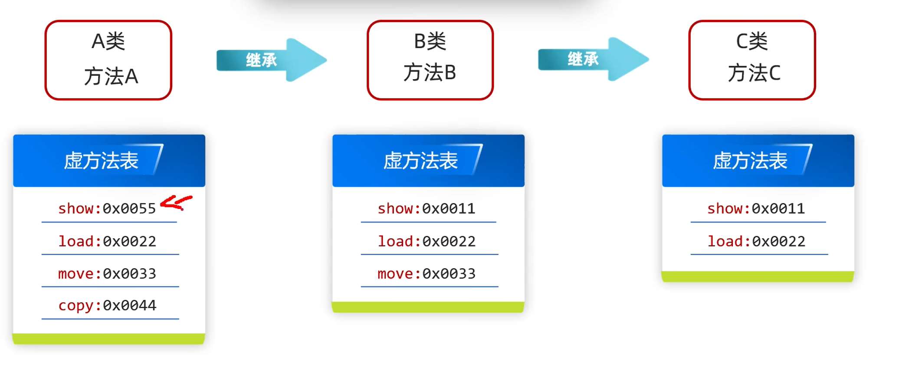

1. 继承是类与类之间的一种父子关系，java中提供extends用于建立类与类之间的关系
2. Java 没有私有继承、保护继承，只有 extends 一种公有继承，CPP三种都有
3. java只支持单继承，不支持多继承（CPP支持），但支持多层继承
4. java的顶级父类-Object
5. java继承的特点
    * java只支持单继承，不支持多继承（CPP支持），但支持多层继承
    * 直接继承的父类叫做直接父类，间接继承的爷爷叫做间接父类
    * java的每一个类都直接或者间接的继承于Object
6. <mark>继承中成员变量的查找顺序(没加this、super关键字)：就近原则，先在局部位置找，本类成员位置找，父类成员位置找，逐级往上</mark>
7. <mark>继承中成员变量的访问顺序(没加this、super关键字)：就近原则，先在局部位置找，本类成员位置找，父类成员位置找，逐级往上，直到 Object 类还找不到，编译报错，能找到但能不能使用，看权限修饰符（如果父类是private，那么子类也是不能用的）</mark>(比如：number 在 Delivery 中是 private 访问控制)
8. <mark>继承中成员方法的查找顺序(没加this、super关键字)：就近原则，先在当前子类本类找有没有该方法，子类没有 → 一级一级往上父类找；找到就执行，子类重写了就优先执行子类重写的；一直找到 Object 还没有 → 编译报错</mark>
9. <mark>继承中成员方法的访问顺序(没加this、super关键字)：就近原则，先在当前子类本类找有没有该方法，子类没有 → 一级一级往上父类找；找到就执行，子类重写了就优先执行子类重写的；一直找到 Object 还没有 → 编译报错，能找到但能不能使用，看权限修饰符（如果父类是private，那么子类也是不能用的）</mark>(比如编译报错：错误: calculateCost() 在 Delivery 中是 private 访问控制)
10. 继承中，this调用会先访问本类，再访问父类；super关键字直接访问父类
11. <mark>注意：`this`关键字不会管方法的局部变量，而是强制访问成员变量；`super`则是强制访问父类的属性/方法</mark>
12. `super`关键字：表示使用父类的属性/方法。如`super.name`
13. 继承中`super`不能嵌套，比如`super.super.name`是错的
14. 继承中成员变量的书写规则：抽取共性
15. 方法重写：在子类中，把父类的方法再写一遍，方法声明保持一致
16. 重写方法的名称、形参列表必须与父类中的一致，方法体按照实际需要书写
17. @Override这是一个注解，是给JVM看的，表示下面的方法是重写的父类的方法。CPP方法重写是父类(用virtual)、子类(用override)
18. 如果父类里面的代码，一行都不用，此时把子类中的方法体重新完整写一遍即可；如果父类里面的代码还想用，此时只是在父类继承上再加其它逻辑。那么就可以先通过super关键字调用父类的方法得到一个结果，再堆这个结果进行操作
19. final修饰类为最终类，里面所有方法不能被重写，这个类也不能被继承
20. <mark>private方法、static方法、final方法都不能被重写</mark>
    * private方法/属性是不能被子类看见的，这和CPP一样，就算是公有继承，就算是`super.`也是不行的，也是看不见的，因此不能重写
    * static方法属于类，不属于对象，方法调用版本在编译期就确定，类加载链接阶段完成地址解析绑定，不依赖运行时对象类型，因此没有多态，不能被重写；而重写依赖动态绑定、依赖多态，运行时看真实对象（这一点和CPP中static方法不能为虚函数类似）
    * final方法本身就规定不能再修改
21. 重写和重载是不一样的概念
22. 多态允许相同的操作在不同的对象上表现出不同的行为,分为:静态多态(编译时多态)和动态多态(运行时多态)
23. <mark>java中静态多态用方法重载来实现；运行时多态用继承+重写来实现:</mark>
    ```java
    // 编译时多态
    public class StaticPoly {
    // 重载1：一个int参数
    public void calc(int a) {
    System.out.println("整数计算：" + a);
    }
    // 重载2：两个int参数
    public void calc(int a, int b) {
    System.out.println("两整数和：" + (a + b));
    }
    // 重载3：double参数
    public void calc(double a) {
    System.out.println("小数计算：" + a);
    }
    public static void main(String[] args) {
        StaticPoly sp = new StaticPoly();
        sp.calc(10);        // 编译匹配 第1个
        sp.calc(10, 20);    // 编译匹配 第2个
        sp.calc(3.14);      // 编译匹配 第3个
    }
    }
    ```
    ```java
    // 运行时多态
    // 1. 父类
    class Animal {
    public void cry() {
        System.out.println("动物叫");
    }
    }
    // 2. 子类继承 + 重写方法
    class Dog extends Animal {
    @Override
    public void cry() {
        System.out.println("汪汪汪");
    }
    }
    class Cat extends Animal {
    @Override
    public void cry() {
        System.out.println("喵喵喵");
    }
    }
    public class Test {
        public static void main(String[] args) {
        // 3. 向上转型：父类引用 指向 子类对象
        Animal a = new Dog();
        Animal b = new Cat();
        // 4. 调用重写方法 → 触发运行时多态
        a.cry();  // 输出：汪汪汪
        b.cry();  // 输出：喵喵喵
        }
    }
    ```
24. <mark>开发里99% 场景重写都配合多态一起用（类似CPP的虚函数/重写配合多态一样）</mark>
25. <mark>java中和CPP一样也自动向上类型转换:将派生类引用转换为基类的引用,这是自动进行的(<=>指向基类的引用可以引用派生类对象);java的向下类型转换(有风险)，必须手动强制转换（`子类 子类对象变量=(子类)父类类型的变量`）：</mark>
    ```java
    // 子类类型 变量名 = (子类类型) 父类引用;
    class Fu {}
    class Zi extends Fu {}
    // 向上转型（自动）
    Fu f = new Zi();
    // 向下转型（手动强转）
    Zi z = (Zi) f;
    ```
26. Java 普通方法默认可重写、默认动态绑定，不需 virtual；CPP 默认静态绑定，必须父类加 virtual 才能重写 + 运行时多态
27. 父类构造方法不会被继承
28. this和super用法汇总
    
29. 如果在构造方法中写上了this(),就不能再写super()了，JVM也不会自动添加super()
30. 子类继承≠子类调用
31. java的虚方法就是普通成员方法，非final、static、private
32. static成员变量继承也只会在父类和子类中共享
33. 子类真正能继承父类的：
    * 构造方法：不能被子类继承，可以利用super关键字调用
    * 成员变量：可以被子类继承，private私有也可以被继承，但是私有的不能被直接调用，可以通过get/set方法调用。静态变量可以被继承、能被子类直接访问使用，但不属于子类对象，仍然只属于父类。一旦父类有静态变量，整个继承体系里所有子类都能直接访问，相当于共享同一个
    * 成员方法：
      * 虚方法可以被继承
      * final修饰的方法能被继承，可以被调用
      * static修饰的方法能被继承，可以被调用
      * private修饰的方法不能被继承，不能被调用、
34. 虚方法的继承规则就是利用虚方法表，而方法重写就是替换虚方法表中对应虚方法中的地址
    
35. java的虚方法表和CPP的虚函数表类似
    * 都是为了实现运行时多态
    * 都是在类加载阶段创建
    * 每个类一张表
    * 表内存放方法的地址（入口指针）
    * 运行时通过对象找到表，再找到方法地址 → 动态绑定
    * 表都是静态类型的
    * 执行流程都是利用对象头里的一个指针来指向虚表，这也就是多态的原理
36. cpp中不加 virtual 的方法 不进表，没有多态；java中private、static、final方法不进表
37. 如果子类没有新增任何虚方法、也没有重写任何方法： Java 和 Cpp 都不会新建表，直接和父类共享同一张虚方法表
38. java和cpp都是：一个类的虚表只会有一份,就算这个类实例了很多对象,它们也是共享一个虚表的
39. <mark>java中每个new出来的对象在对象头都有一个Klass Pointer，用于指向存在元空间的虚表</mark>
40. <mark>java语法层面是没有指针的，而底层JVM虚拟机层面是有指针的，因为是C++代码</mark>
41. <mark>对象头的Klass指针存在每个对象中，在堆里；而CPP的虚表指针是类的非静态成员变量，new出来的对象就在堆，局部变量对象在栈里</mark>
42. <mark>java的虚表在元空间，类元数据里，元空间属于JVM的本地内存，不是堆、不是栈、不是方法区，是操作系统直接给JVM的堆外内存，所以虚表在堆外内存里；CPP虚表在只读数据段</mark>
43. <mark>java的多态原理和cpp基本一样，共同点</mark>
     * 每个类一张表，同类所有对象共享同一张表，对象只存指针指向表
     * 父类引用指向子类对象 → 运行时顺着对象找子类的表 → 执行子类重写的方法
     * 子类先拷贝父类表，重写就覆盖表项，不重写就复用父类地址； 子类新增方法才会扩建表
44. <mark>java的多态和cpp不同点：</mark>
     * 如果一个类没有虚函数/方法,那么通常它不会有虚表和虚表指针/（除非它当前类为一个有着虚函数的基类派生而来的情况,此时这个当前的派生类也会有共享父类的虚表和虚表指针）
     * cpp中不加 virtual 的方法 不进表，没有多态；java中private、static、final方法不进表
     * cpp是编译期构建虚表，运行期敲定地址；java编译只做语法，在类加载阶段构建表，运行时查表动态绑定
45. <mark>java和CPP中如果没有虚表和虚表指针也是可以访问到父类方法的，只是要一级一级往上查找，但是有了虚表指针和虚表就可以直接访问自己的表，加快了速度，空间换了时间</mark>
46. 多态的表现形式：`父类类型 对象名称=new 子类对象;`
47. 多态的前提：
    * 有继承/实现关系
    * 有父类引用指向子类对象（向上类型转换）
    * 有方法重写（不是必须的）
48. <mark>多态调用成员的特点（java和Cpp都是）：</mark>
    * `父类名称 对象名称=new 子类对象;`,它的编译类型是父类类型，运行类型是子类类型
    * 调用成员变量：编译看左边，运行也看左边；`父类名称 对象名称=new 子类对象; 对象名称.成员变量;`：此时访问的是父类的成员变量
    * 调用成员方法：编译看左边，运行看右边（运行时多态）；`父类名称 父类对象名称=new 子类对象; 父类对象名称.成员方法();`：此时访问的是子类的成员方法，如果子类没有，那么访问父类的方法
    * 不能调用子类独有的成员方法：`父类名称 父类对象名称=new 子类对象; 父类对象名称.成员方法();`：此时访问不了子类独有的方法，需要向下强制类型转换
    ```java
    class Father {}
    class Son extends Father {
    public void sonOnly(){}
    }
    public class Test {
    public static void main(String[] args) {
    Father f = new Son();
        // 先判断是不是 Son运行类型
        if (f instanceof Son) {
            Son s = (Son) f; // 安全向下转型
            s.sonOnly();     // 调用子类独有方法
        }
        }
    }
    ```
49. <mark>向下类型转换时，一般会先判断运行类型是否正确。java判断判断左边对象是不是右边类/接口的实例的类型`instanceof`</mark>
    ```java
    if (obj instanceof 类名/接口名) {}
    ```
50. <mark>抽象方法：将共性的方法抽取到父类后。因为每一个子类的方法体是不一样，所以在父类中不能确定具体的方法体。该方法就可以定义为抽象方法（类似cpp的纯虚函数）</mark>
    ```java
    public abstract 返回值类型 方法名(参数列表) {}
    ```
51. <mark>抽象类：如果一个类中存在抽象方法，那么该类就必须声明为抽象类（类似cpp的抽象类）</mark>
    ```java
    public abstract class 抽象类名 {}
    ```
52. <mark>final、private、static不能和抽象方法/类结合使用</mark>。因为抽象方法/类需要被重写</mark>
53. <mark>抽象类被继承后如果是普通类(没加`abstract`关键字)，那么必须把父类的抽象类都要实现；如果子类也是`abstract`类，那么子类可以不用全部实现/或者不实现父类的抽象方法。CPP也是的，只是说CPP没有`abstract`关键字，而是在方法内用`virtual`关键字来声明抽象方法</mark>
54. <mark>java中抽象类特点：</mark>
    * 抽象类不能实例化对象：抽象方法只声明、没实现，是空的、没具体逻辑。 如果允许创建抽象类对象： 那对象调用这个抽象方法时，没有代码可以执行，程序直接崩（java和cpp一样）
    * java中抽象类中不一定有抽象方法，里面可以全是普通成员、普通方法，一个抽象方法都没有，其作用是为了不让外界实例化本类的对象，只能被继承。cpp中有抽象方法才是抽象类
    * 抽象类中可以有构造方法，如果没有自定义，也会默认生成：为了给成员变量赋值，并且子类一定会调用父类构造器。抽象类构造不是用来自己 new 对象，纯粹服务于子类继承
    * 抽象类的子类要么重写抽象类中的所有抽象方法，此时就是普通类；要么子类也是抽象类
55. 抽象类和抽象方法的优点：
    * 抽象方法强制子类必须实现规范
    * 抽象方法统一方法声明，约束子类结构
    * 抽象方法为多态提供基础，天然的多态
    * 抽象类抽取公共代码，代码复用
    * 抽象类禁止实例化，只做模板
    * 抽象类兼具 模板 + 规范 双重能力
    * 抽象类降低耦合，便于扩展