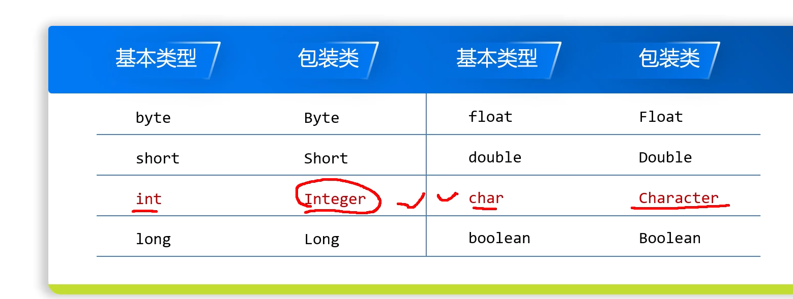

1. API就是Java提供好的一些类
2. java中不用导入包
   * 使用本包下面的类
   * 使用java.lang包下面的类
3. 字符串拼接不会改变原来的的字符串，而是产生一个新的字符串
4. 字符串的内容是不可变的，它的对象在创建后不能被更改
5. 创建String对象的方式：
   * 直接赋值
   * new+构造方法：
     * new+空参构造`String s = new String();`
     * new+有参构造`String s = new String("hello");`
     * new+字节数组构造`String s = new String(byte[] bytes);`
     * new+字符数组构造`String s = new String(char[] chars);`
6. <mark>java不支持`[]`通过下标从字符串中索引取字符的方法，只能`charAt()`，而CPP可以</mark>
7. <mark>字符串常见方法:</mark>
   * 对于字符串这种引用数据类型，`==`比较运算符比较的是内存地址
   * `s1.equals(b)`可以用来比较字符串引用数据类型的内容；`s1.equalsIngoreCase(s2)`可以忽略大小写来比较内容
   * 根据索引返回字符串中的字符`s.charAt(index)`；返回字符串长度`s.length()`
   * 从控制台输入字符串：`sc.next()`:
   * for增强不能直接遍历 String，因为Java 里 String 不是数组，也不是集合，不能直接放增强 for 里遍历，需要通过`for (char c: str.toCharArray()) {}`
   * 判断字符是否大写`Character.isUpperCase(ch)`;`Character.isLowerCase(ch)`
   * 判断字符是否数字`Character.isDigit(ch)`
   * 判断字符是否字母：`Character.isLetter(ch)`
   * 字符串截取：`s.substring(startIndex)`从开始索引截取到该字符串最后;`s.substring(startIndex, endIndex)`（包头不包尾）
   * 字符串替换：`s.replace(oldChar, newChar)`，`str.replace("TMD", "***");`，找不到就不替换
   * 字符串查找子串：`s.indexOf(subString)`：找到返回下标，找不到返回-1；`s.lastIndexOf(subString)`：查找子串在字符串s中最后出现位置，也就是从后往前查找
   * 判断字符串是否以子串开头/结尾：`s.startsWith(subString)`/`s.endsWith(subString)`
   * 判断是否包含子串：`s.contains(subString)`
   * 判断是否为空：`s.isEmpty()`
   * 数组转为字符串`Arrays.toString(arr)`此时的arr任何类型数组都可以，但是需要注意此时转换的字符串包含了`[]`；`String newStr = new String(arr);`此时的arr只能是字符数组、字节数组，
   * 字符数组转字符串：`new String(arr)`
   * 数字转字符串：`int a=10; String.valueOf(a);`;`""+num`:空字符串+数字
   * 字符转字符串：`char ch = 'a'; String.valueOf(ch);`;`""+ch`:空字符串+字符
   * 字符串转字符数组：`s.toCharArray()`
   * 字符串中字符的大小写转换：`s.toUpperCase()`/`s.toLowerCase()`
   * 去除字符串头尾空格：`s.trim()`
   * 重复字符串：`s.repeat(count)`，s是字符串，不是字符
8. CPP的字符转字符串可以`String(1, ch)`，但是java是不能的，java需要写为字符数组再用实例化`String`的方法，`new String(new[] char{ch})`
9. 需要注意：字符串不可更改，因此用了字符串方法修改字符串后需要用其返回字符串进行操作，原字符串没变
10. <mark>字符拼接不是字符串，纯字符相加 = ASCII 数值相加，不是字符串，CPP也是一样的</mark>
11. java中`'a'*3`≠`"aaa"`，CPP也不行，java中只能`"a".repeat(3)`才行
12. <mark>StringBuilder是字符串的一个工具类，可以让我们拼接字符串的时候效率更高。传统的`+`会产生很多冗余的中间数据，StringBuilder可以看作容器，此时就是把待拼接的字符串放入容器，没有中间冗余字符串</mark>
    * `StringBuilder sb = new StringBuilder()`/`tringBuilder sb = new StringBuilder(str)`
    * `sb.append(任意类型)`：添加任意类型数据，返回自身
    * `sb.toString()`：将StringBuilder转换成String
    * `sb.insert(int index, 任意类型)`：在指定位置插入任意类型数据，返回自身
    * `sb.reverse()`：翻转字符串
    * `sb.length()`：获取字符串长度
    * `sb.toString()`：将StringBuilder转换成String
13. `sb.append(name).append("：[");`和`sb.append(name + "：[");`语法上都没问题，但是后者会产生一个临时字符串，再把这个整体丢进 StringBuilde，占用内存
14. java中数字字符串转数字：
    * `int num = Integer.parseInt(s);`
    * `Integer i = Integer.valueOf(s);`
    * `double d = Double.parseDouble(s);`
    * `Long l = Long.parseLong(s);`
15. CPP中数字字符串转数字：`stoi`、`stod`
16. java的整数数组转换为字符串：
    * `String s = Arrays.toString(arr)`：带括号格式 [1,2,3]
    * 纯数字拼接可以用`StringBuilder`
    ```java
    int[] arr = {1,2,3};
    StringBuilder sb = new StringBuilder();
    for(int num : arr)
        sb.append(num);
    String res = sb.toString();
    => "123"
    ```
    CPP可以借用`to_string()`
    ```cpp
    int main()
    {
        int arr[] = {1,2,3,4};
        int len = sizeof(arr)/sizeof(arr[0]);
        string res;
        for(int i=0;i<len;i++)
            res += to_string(arr[i]);
        cout << res; // 1234
        return 0;
    }
    ```
17. 数组一旦定义后长度就定了，如果要动态自动修改其大小就要用集合，类似CPP的容器
18. java中的集合：
    * 单列集合：`ArrayList`、`LinkedList`、`Vector`、`HashSet`、`LinkedHashSet`、`TreeSet`、`ArrayDeque`、`PriorityQueue`等
    * 双列集合：`HashMap`、`LinkedHashMap`、`TreeMap`、`HashTable`、`Hashtable`等
19. <mark>集合是无法添加基本数据类型，只能添加引用数据类型/对象，如果要在集合中一定要添加基本数据类型，就要使用包装类</mark>。这其实是泛型类的特性
    
20. java也有`Vector`，但是现在基本不用，推荐用`ArrayList`，`ArrayList`底层是动态数组，其常用方法：
    * 实例化集合对象：`ArrayList<E> list = new ArrayList<>();`，`ArrayList`是一个泛型类，必须加`<>`
    * 添加数据：`add(E element)`；`void add(int index, E element)`
    * 删除数据：`boolean remove(E element)`；`E remove(int index)`
    * 修改数据：`set(int index, E element)`
    * 修改数据：`E set(int index, E element)`
    * 获取数据：`E get(int index)`
    * 获取集合大小：`int size()`
    * 集合转数组：`toArray()/toArray(T[] a)`：此时只能传给Object数组，比如`ArrayList<String> list = new ArrayList<>();Object[] objs = list.toArray();`。`toArray(T[] a)`，此时需要在形参中构造成数组形式，比如：`String[] strArr = list.toArray(new String[0]);`：传空数组`new String[0]`，传入长度为 0 的数组，内部发现数组不够装，自动新建一个和集合等长的同类型数组，此时不用算长度；`String[] strArr2 = new String[list.size()];`：传等长数组`new String[list.size()]`，手动开好刚好够用的数组，多写一步算长度，麻烦
    * 集合转字符串：`toString()`
21. <mark>增强 for（for-each）能遍历所有单列集合、双列集合值、数组</mark>