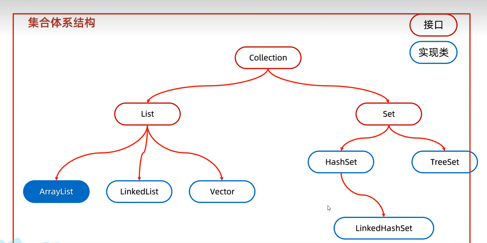
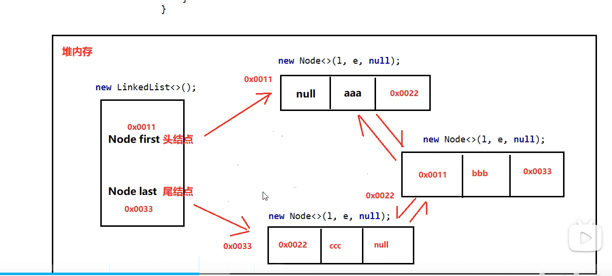
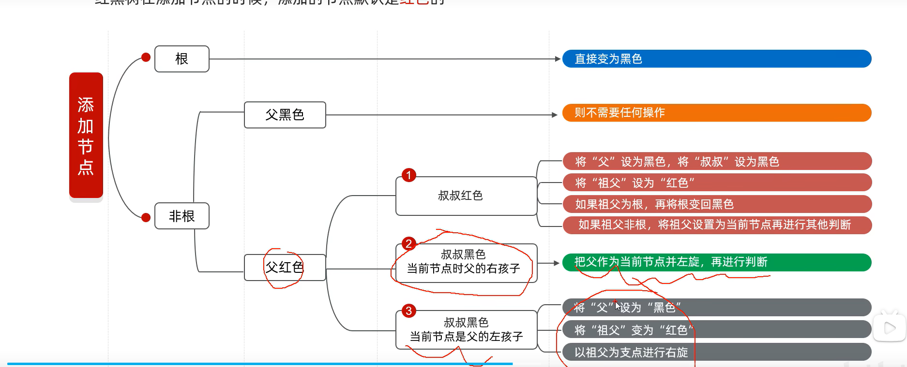
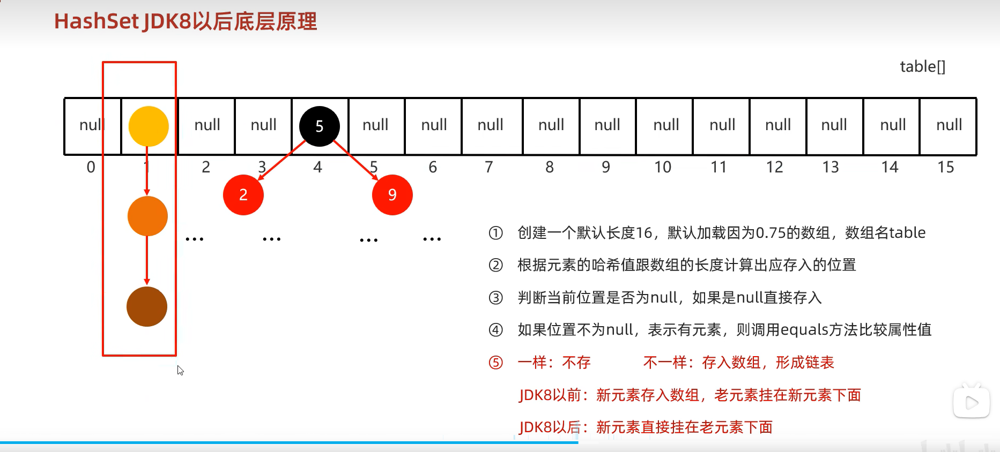
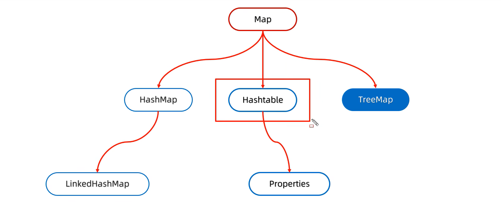

1. lambda表达式是JDK8之后出现的
2. lambda表达式可以简化函数式接口的匿名内部类的写法
3. Lambda可被替换为方法引用，需要满足：
   * Lambda表达式里只有一行代码
   * 这行代码就是调用一个已有的方法
     ```txt
     (参数) -> 对象.方法(参数)   
        ↓ 替换成
     对象::方法
     ```
   * 比如常见的：
     ```java
     // 实例方法引用
     s -> System.out.println(s)
     // 方法引用
     System.out::println
     // 进一步举例
     Collection<String> coll = new ArrayList<>();
     coll.add("a");
     coll.add("b");
     coll.forEach(e -> System.out.println(e));
     // =>
     coll.forEach(System.out::println);
    
     // 静态方法引用
     i -> Integer.parseInt(i)
     // 方法引用
     Integer::parseInt
    
     // 构造方法引用
     () -> new String()
     // 方法引用
     String::new
    
     // 任意对象的实例方法
     s -> s.toString()
     // 方法引用
     Object::toString
     ```
4. 必须是接口的匿名内部类，接口中只能有一个抽象方法，才能用lambda表达式简化
5. <mark>java的常用集合都是泛型类/接口</mark>
6. <mark>java中集合不管是支持索引还是不支持，都不能像cpp那样用`[]`获取元素</mark>
7. <mark>java中的集合：</mark>
    * 单列集合：`ArrayList`、`LinkedList`、`Vector`、`HashSet`、`LinkedHashSet`、`TreeSet`、`ArrayDeque`、`PriorityQueue`等
    
      * `List`（一个接口）系列集合：添加的元素是有序（存和取的顺序是一样的）、可重复、有索引（可以通过索引操作元素）
        * List新增了很多索引操作的方法，如：
          * `public E get(int index)`：根据索引获取元素
          * `public E set(int index, E element)`：根据索引设置元素
          * `public void add(int index, E element)`：根据索引添加元素，原来位置的元素向后移动，新元素插入到指定位置
          * `public E remove(int index)`：根据索引删除元素，返回被删除的元素
        * List集合的遍历方式：它继承于`Collection`，所以也可以用`Collection`的遍历方式遍历，即遍历方式有：
          * 迭代器遍历
          * 列表迭代器遍历：`ListIterator`，这也是一个接口，它是`Iterator`的子接口，新增了很多方法，如`add()`、`set()`等
          ```java
          ArrayList<String> list = new ArrayList<>();
          ListIterator<String> it = list.listIterator();// E是集合list中元素的类型
          while (it.hasNext()) {// 判断是否有下一个元素
              String e = it.next();// 返回当前迭代器位置的元素，并将迭代器移动到下一个元素的位置
              System.out.println(e);
              it.add("aaa");
          }
          ```
          * 增强for遍历
          * lambda表达式遍历
          * 普通for循环
          ```java
          for(int i=0;i<list.size();i++){
              System.out.println(list.get(i));
          }
          ```
      * `List`集合有一个利用集合工具类`Collections`的排序方法：`Collections.sort(List)`
      * `Set`（一个接口）系列集合：添加的元素是无序（存和取的顺序是不一致的）、不可重复、无索引
      * `Set`的遍历方式，它继承于`Collection`，所以也可以用`Collection`的遍历方式遍历，即遍历方式有：
        * 迭代器遍历
        * 增强for遍历
        * lambda表达式遍历
      * `Collection`是单列集合的祖宗接口，它的功能是全部单列集合都可以继承使用的：
        * `public boolean add(E e)`：添加一个元素
        * `public void clear()`：清空集合
        * `public boolean remove(Object o)`：删除一个元素
        * `public boolean contains(Object o)`：判断是否包含某个元素
        * `public int size()`：返回集合的大小
        * `public boolean isEmpty()`：判断集合是否为空
        * `public void clear()`：清空集合
      * `Collection`的遍历方式：
        * 迭代器遍历（C++ 的迭代器 = Java 的 Iterator）：迭代器（和cpp一样，可以理解为指针，在源码其实就是用一个`cursor`属性来记录当前遍历的位置，也就是一个指针作用）在java中的类是`Iterator`，迭代器是集合专用的遍历方式，这种方式不依赖索引
          ```java
          ArrayList<E> list = new ArrayList<>();
          Iterator<E> it = list.iterator();// E是集合list中元素的类型
          while (it.hasNext()) {// 判断是否有下一个元素
              E e = it.next();// 返回当前迭代器位置的元素，并将迭代器移动到下一个元素的位置
              System.out.println(e);
          }
          ```
          ```cpp
          vector<int> list;
          vector<int>::iterator it;// 迭代器遍历
          for (it = list.begin(); it != list.end(); it++) {
              cout << *it << endl;
          }
          ```
          * 迭代器遍历完毕，指针不会复位
          * 循环中只能用一次next方法
          * 迭代器遍历时，不能用集合的方法进行增加或删除(迭代器源码`next()`方法第一行就会用`checkForComification()`方法来判断是否使用了集合中的方法添加/删除元素，用了就会抛出并发修改异常)，要用迭代器的方法进行增加或删除
          * 如果当前位置没有元素，还要强行获取，会报`NoSuchElementException`异常
          * 普通`Iterator`遍历没有新增操作的方法，有`remove()`
        * 增强for循环遍历：底层就是迭代器，为了简化迭代器的代码书写，它是jdk5之后出现的
          ```java
          ArrayList<E> list = new ArrayList<>();
          for (E e : list) {
              System.out.println(e);
          }
          ```
        * lambda表达式遍历：底层就是迭代器，为了简化迭代器的代码书写，它是jdk8之后出现的。方法的底层其实也会自己遍历集合，依次得到每一个元素，把得到的每一个元素，传递给下面的lambda表达式
          ```java
          ArrayList<E> list = new ArrayList<>();
          list.forEach(new Consumer<E>() {
              @Override
              public void accept(E e) {
                  System.out.println(e);
              }
          });// Consumer是一个函数式接口
          // 用lambda表达式简化 <=>
          list.forEach((e) -> System.out.println(e));
          ``` 
8. <mark>遍历中需要删除元素，用迭代器；在遍历过程中需要添加元素，使用列表迭代器；单纯取值遍历优先增强for、lambda表达式；如果遍历的时候想操作索引，可以用普通for</mark>
9. <mark>java中集合的打印：集合类都重写了`toString()`方法，会打印内部元素，因此可以直接输出集合名，而不是用`Object`类的`toString()`方法而打印内存地址码，如`ArrayList、LinkedList、HashSet、HashMap`等</mark>
10. List：`ArrayList`、`LinkedList`、`Vector`
11. `ArrayList`底层扩容原理（对应cpp的vector）：
    * 利用空参创建的集合，在底层创建一个默认长度为0的数组
    * 添加第一个元素时，底层会自动创建一个新的长度为10的数组，因此常说ArrayList底层最初是一个长度为10的数组
    * 存满时，会自动扩容，扩容的策略是：当前数组长度的1.5倍，即新增老容量的一半
    * 然后将原数组中的元素，复制到新数组中
    * 如果一次性添加多个元素（`.addAll()`），1.5倍还放不下，则新创建数组的长度以实际为准，比如：
    ```txt
     假设现在 ArrayList 容量是 10
     里面已经存了 10 个元素，满了
     现在你要 一次性 addAll 添加 100 个元素
     步骤：
     先算 1.5 倍：10 * 1.5 = 15
     但 15 根本放不下 100 个元素
    （底层newLength（）源码中100>5，所以扩充100）
     所以 不使用 1.5 倍规则
     直接创建新数组，长度 = 10 + 100 = 110
    ```
12. `LinkedList`对应cpp的list，底层数据结果是双向链表，查询慢、增删快，但是如果操作的是首尾元素，那么查询也是极快，O(1)复杂度，LinkedList 内部单独存了尾节点引用，不用遍历，直接取值。常用操作首尾方法：
    * `public void addFirst(E e)`：在链表头添加一个元素
    * `public void addLast(E e)`：在链表尾添加一个元素
    * `public E removeFirst()`：删除链表头元素
    * `public E removeLast()`：删除链表尾元素
    * `public E getFirst()`：返回链表头元素
    * `public E getLast()`：返回链表尾元素
13. `LinkedList`所含的双向链表：
    ```java
    private static class Node<E> {
        E item;
        Node<E> next;
        Node<E> prev;
        Node(Node<E> prev, E item, Node<E> next) {
            this.prev = prev;
            this.item = item;
            this.next = next;
        }
    }
    ```
    
14. 集合中为什么要使用泛型？
    如果我们没有给集合指定类型，默认认为所有的数据类型都是Object类型，此时可以往集合添加任意数据类型。
    但是此时，我们在获取数据的时候，没办法用Object类型去调用子类的特有方法（多态的弊端）。如果强转，因为我们
    不知道集合中到底存储的是什么类型，强制转换很容易出现类型转换异常，因此推出了泛型
15. <mark>泛型是JDK5引入的特性（jdk5之前集合中没有泛型，只能用Object类型），可以在编译阶段约束操作的数据类型，并进行检查，注意：</mark>
    * 格式：`<数据类型1,数据类型2,...>`，可以传递多个不确定数据类型
    * 泛型只支持引用类型，不支持基本类型，如果要使用基本类型，需要使用包装类
    * 泛型就是为了统一数据类型而出现的
    * java中的泛型是伪泛型，因为java是编译时类型检查，而泛型是在编译时引入的，编译时会把泛型替换为Object类型，因此在运行时JVM 虚拟机层面，不存在泛型类型信息，泛型只在编译阶段生效，程序跑起来后<T>标记彻底消失。也就是泛型擦除：Java 编译后，泛型`< >`里的类型会被删掉，全部变成`Object`类型
    ```java
    ArrayList<String> strList = new ArrayList<>();
    ArrayList<Integer> intList = new ArrayList<>();
    System.out.println(strList.getClass() == intList.getClass());  // true
    ```
      * 虽然编译擦除后，泛型标记消失，运行时就都是`Object`类型，此时传入`Integer`类型单从运行的角度看是不会报错的，但是这一步
      其实连编译都通过不了，因为会先进行编译类型检查
      ```java
      // 最初编写的代码
      // 编写代码，此时T视作String
      ArrayList<String> list = new ArrayList<>();
      list.add("java");
      String str = list.get(0);
      // 此时会先在编译阶段进行编译检查，必须和String匹配才能通过编译类型检查
      list.add(123); // 编译错误，类型不匹配。试图传入 Integer，编译器直接报错，连运行的机会都没有

      // 编译后擦除后，运行时就没<>了
      // 泛型标记消失，T统一擦为Object
      ArrayList list = new ArrayList();
      list.add("java");
      // 编译器自动插入强转
      String str = (String) list.get(0);
      ```
      * 如果想在运行时传入存任意类型，也就是绕过编译时的检查，可以使用反射机制，比如：
      ```java
      // 反射机制
      ArrayList<String> list = new ArrayList<>();
      list.add("Hello");
      // 获取 ArrayList 的 add 方法 —— 运行时签名是 add(Object)
      Method addMethod = list.getClass().getMethod("add", Object.class);// 塞入一个整数 123
      addMethod.invoke(list, 123);
      ```
    * 泛型可以写在类、方法、接口中
    * 当一个类中，某个变量的数据类型不确定时，就可以定义带有泛型的类
    * 泛型类：
    ```java
    修饰符 class 类名<E> {
        // 类体
    }
    ```
    * 泛型方法：方法中形参类型不确定时，可以有两种办法：
        * 使用类名后面定义的泛型（所有方法都能用）
        * 在方法申明上定义自己的泛型（只有本方法能用）
        ```java
        修饰符 <E> 返回值类型 方法名(参数列表) {
        // 方法体
        }
        ```
    * 泛型方法的调用方式：
      *  自动推断（不用写<T>）：编译器会自动根据你传的参数判断 T 是什么类型，不用手动写类型
      ```java
      // 这是一个泛型方法 <T> 代表声明泛型
      public class Test {
      // 泛型方法：<T> 写在返回值前面
        public static <T> T print(T t) {
          System.out.println(t);
          return t;
        }
      }
      String s = print("Hello");
      Integer i = print(123);
      Double d = print(3.14);
      ```
      * 显式指定类型（手动写<T>）：
      ```java
      // 显式指定类型（手动写<T>）
      String s = Test.<String>print("Hello");
      Integer i = Test.<Integer>print(123);
      ```
      * 如果方法没有参数，编译器无法推断，必须手动写类型:
      ```java
      public static <T> T get() {
        return null;
      }
      String s = Test.<String>get(); // 必须写 <String>
      ```
    * 泛型接口：两种实现方式：
      ```java
      修饰符 interface 接口名<E> {
        // 接口体
      }
      ```
      * 实现类给出具体的类型
      ```java
      public class MyArrayList implements List<String> {
      }
      ```
      * 实现类延续泛型，创建实现类对象时再给出具体类型
      ```java
      public class MyArrayList implements List<E> {
      }
      MyArrayList<String> list = new MyArrayList<>();
      ```
    * 泛型不具备继承性(如果需要可以传入子类或者其父类就要用通配符)，但是数据具有继承性：指定泛型的具体类型后，传递数据时，可以传入该类类型或者其子类类型
    ```java
    // 泛型不具备继承性
    class Ye {}
    class Zi extends Ye {}
    // 定义方法
    public static void test(ArrayList<Ye> list) {}
    // 调用
    ArrayList<Ye> list1 = new ArrayList<>();
    ArrayList<Zi> list2 = new ArrayList<>();
    test(list1);  // ✅ 可行
    test(list2);  // ❌ 编译报错
    
    // 数据具体继承性
    ArrayList<Ye> list = new ArrayList<>();
    list.add(new Ye());  // ✅ 父类本身
    list.add(new Zi());  // ✅ 子类对象
    ```
    * 泛型的通配符：可以用来限定类型的范围
    ```java
    // 假设已经有Zi、Fu、Ye、Student几个类，前面三个有继承关系
    ArrayList<Ye> list1 = new ArrayList<>();
    ArrayList<Fu> list1 = new ArrayList<>();
    ArrayList<Zi> list1 = new ArrayList<>();
    ArrayList<Student> list1 = new ArrayList<>();
    method(list1);
    method(list2);
    method(list3);
    method(list4);
    // ? extends E：表示可以传递 E 类型或者其子类类型
    public static void method(ArrayList<? extends Ye> list) {
    }// 此时method(list4);会报错，因为Student不是Ye的子类
    // ? super E：表示可以传递 E 类型或者其父类类型
    public static void method(ArrayList<? super Fu> list) {
    }// 此时method(list3);method(list4);会报错，因为Fu和Zi不是Ye的父类
    ```
    * `?`为无界通配符，仅用于引用变量、参数处，不能用来定义泛型
    * 以后如果我们在定义类、方法、接口的时候，如果类型不确定，就可以定义泛型类、方法、接口。如果类型不确定，但是能知道以后只能传递某个继承体系中的，就可以泛型的通配符
16. 平衡二叉树 (AVL 树) 插入很可能触发复杂的节点旋转，失衡高度差超 1 就旋转修正（可以用跳表改善）
17. 平衡二叉树是在二叉查找树（二叉搜索树/二叉排序树）的基础上，添加了高度平衡的约束，确保了插入、删除、查找等操作的效率
18. <mark>红黑树是一种自平衡的二叉查找树，它是一种特殊的二叉查找树，它满足了以下条件：
    * 红黑树不是高度平衡的，它的平衡是通过”红黑规则“进行实现的：
      * 每个节点要么是红色，要么是黑色
      * 根节点是黑色
      * 每个叶子节点（NiL）是黑色，实际叶子是黑色空哨兵节点，真正存储数据的是内部节点，所有末端统一挂载黑色 NIL 空节点。NIL 就是标准叶子，无数据、仅标识边界
      * 每个红色节点的两个子节点都是黑色的
      * 每个黑色节点的两个子节点都是红色的
      * 每个节点到后代叶子节点的路径上，均包含相同数目的黑色节点
    * 红黑树节点中多了一个颜色属性，用于表示节点的颜色，红色或黑色
19. 红黑树添加节点：
    * 默认添加的节点是红色的，因为效率高
    * 对于根节点和非根节点有不同的规则：
    （”再进行判断“就是再进行规则判断当前节点）
20. <mark>`Set`的实现类包含</mark>
    * HashSet：基于哈希表实现的无序、不重复、无索引的集合，线程不安全，支持快速插入、删除、查找操作
      * 如果集合中存储的是自定义对象，必须要重写`equals()`方法和`hashCode()`方法，否则会用地址值来算哈希值
      * `equals()`方法可以保证去重
    * TreeSet：基于红黑树实现的有元素可排序、不重复、无索引的集合，线程不安全，支持快速插入、删除、查找操作
      * 默认从小到大进行排序
      * `TreeSet`的排序规则：
        * 自然排序（默认排序）：元素类必须实现`Comparable` 接口，重写`compareTo()`方法
          * 对于数值类型，如Integer、Double等，默认从小到大进行排序，它们的`compareTo()`方法已经重写了的
          * 对于字符、字符串类型(它们的`compareTo()`方法已经被重写了的)：按照字符在ASCII码表中的数字升序进行排序，字符串就是从第一个字符开始比较
          * 如果集合中存储的是自定义对象，必须要实现`Comparable`接口，并重写当中的`compareTo()`方法，否则会报错（CPP中容器的自定义比较器接收的是可调用对象，它没有接口、没有抽象方法的说法，因此和java在这是不同的）
          ```java
          public class Student implements Comparable<Student> {
            @Override
            public int compareTo(Student o) {
              return this.age - o.age;
            }
          }
          // o表示红黑树中已经存在的节点
          ```
        * 比较器排序：创建`TreeSet`对象时，传递比较器`Comparator`指定规则（类似CPP中的容器的自定义比较器，传入一个可调用对象）
        ```java
        TreeSet<String> ts = new TreeSet<>(new Comparator<String>() {
          @Override
          // o1:表示当前要添加的元素；o2:表示红黑树中已经存在的元素
          public int compare(String o1, String o2) {
            int i = o1.length() - o2.length();
            // 按照长度排序，如果一样长度，就按照字典序排序
            i = i==0?o1.compareTo(o2) : i;
            return i;
          }
        });
        // =>
        TreeSet<String> ts = new TreeSet((o1, o2) -> {
          // o1:表示当前要添加的元素；o2:表示红黑树中已经存在的元素
          int i = o1.length() - o2.length();
          // 按照长度排序，如果一样长度，就按照字典序排序
          i = i==0?o1.compareTo(o2) : i;
          return i;
        });
        ```
      * `TreeSet`优先使用比较器排序，也就是如果比较器排序有规则，就按照比较器排序，如果没有规则，就按照自然排序
    * LinkedHashSet：基于哈希表和双向链表实现的有序、不重复、无索引的集合，线程不安全，支持快速插入、删除、查找操作
      * 底层数据结构依然是哈希表，只是每个元素又额外的多了一个双链表的机制记录存储的顺序，因此保证了存入和取出是一个顺序
    * 在以后如果要数据去重而对存取顺序没要求，默认使用`HashSet`，其效率高于`LinkedHashSet`
21. <mark>java中哈希表</mark>
    * 在jdk8之前，哈希表的实现是基于数组和链表的，而从jdk8开始，哈希表的实现是基于数组和链表和红黑树的，冲突太多会用数组+红黑树，正常情况是数组+链表，cpp也是一样的
      * jdk8以后：
        * 创建一个默认长度为16，默认负载因子（负载因子=已存储元素个数/哈希表容量(桶总数)）为0.75的数组，数组名为table(`transient Node<K,V>[] table;`)
        * 根据元素的哈希值跟数组的长度计算出应存入的位置，也就是根据哈希值算哈希索引：`哈希索引 = 哈希值 % 数组长度`<=>`哈希索引 = 哈希值 & (数组长度  -1)`
        * 判断当前位置是否为null，如果是null直接存入
        * 如果位置不是null，表示有元素，则调用`equals()`方法比较属性值
          * jdk8以前：此时新元素存入数组，老元素挂在新元素下面
          * jdk8以后：新元素直接挂在老元素下面
        * 当负载因子超过负载因子阈值时，会进行数组扩容，扩容时会将数组中的元素重新哈希到新的数组中
        * 当某个链表的长度>=8且数组的长度>=64时，会将链表自动转换为红黑树，以提高查找效率
        
    * 哈希值是根据元素的哈希函数`hashCode()`方法计算`key`直接或间接（因为还有可能在`hashCode()`后再加工）得到的
    * 如果没有重写`hashCode()`方法，不同对象计算出的哈希值是不同的，因为默认继承`Object`的`hashCode()`，而它是用对象地址算的
    * 如果已经重写`hashCode()`方法，那么哈希值就是根据重写后的`hashCode()`方法计算的，此时属性值相同计算出的哈希值就一样，属性值不同计算出的哈希值也可能一样（哈希冲突）
    * 哈希值不完全等价哈希索引，哈希值对桶数组长度取余后，得到的数组下标是哈希索引
22. 键相同，哈希值一定相同；键不同，哈希值也可能相同，此时就会发生哈希冲突
23. 哈希值一样算出来的哈希索引一定一样
24. 哈希冲突：两个 key 最终存到了同一个索引位置，即算出了了相同的哈希索引，就叫冲突
25. `String`中明明没有看到明确`@Override`，那`hashCode()`和`equals()`真的被重写了吗？
    String 确实重写了 hashCode ()，但源码里就是没写 @Override，这完全正常、合法，不是漏写。
    重写只看方法名和参数列表，不看注解。注解它只是给编译器和人看的 “标记注解”，注解会告诉编译器在编译期检查签名对不对，不加也能重写，只是少了编译期检查。
    虽然注解能有更好的提示，但是历史原因@Override 是 JDK 5 才出的，String 这类核心类很早就存在，源码风格一直没补全
26. 只有集合基于哈希表才会去考虑重写`equals()`方法和`hashCode()`方法，而对于`TreeSet`这种是不需要的
27. 在单列集合中：如果想要集合中的元素可重复：`ArrayList`；如果想要集合中的元素可重复，而且当前的增删操作明显多余查询：`LinkedList`；如果想对集合去重：`HashSet`；如果想对集合去重且保证存取顺序：`LinkedHashSet`；如果想对集合元素排序：`TreeSet`
28. `HashSet`底层`new`了一个`HashMap`对象，`HashMap`的`key`就是`HashSet`的元素，`value`是`null`；`LinkedHashSet`底层`new`了一个`LinkedHashMap`对象，`LinkedHashMap`的`key`就是`LinkedHashSet`的元素，`value`是`null`；`TreeSet`底层`new`了一个`TreeMap`对象，`TreeMap`的`key`就是`TreeSet`的元素，`value`是`TreeMap`对象
29. 双列集合特点：
    * 双列集合一次需要存一对数据，分别为键和值
    * 键不能重复（这和cpp的multimap、unordered_multimap等不同），值可以重复
    * 键和值是一一对应的，每个键只能找到自己对应的值
    * 键+值这个整体称之为键值对或者键值对对象，在java中叫`Entry`对象
    * 不支持通过`key`下标获取`value`，比如：`map[key]`是错误的，只能通过`get()`方法获取。cpp可以
    * java中要修改某个`key`对应的`value`，需要先获取到`value`，再用新的`value`覆盖旧的`value`，而不能像cpp那样直接修改`value`。比如：
    ```java
    map.put(name, map.get(name)+1);
    // 下面是错的
    map.get(name)++;
    ```
    ```cpp
    map[name]++;// 这是对的
    ```
    cpp可以是因为`map[key]`返回的是`value`的引用，所以可以直接修改，而`map.get(key)`返回的是`value`的副本，所以不能直接修改
30. <mark>双列集合</mark>

    * `Map`是双列集合的顶层接口，它的功能是全部双列集合都可以继承使用的，包括方法：
      * `V put(K key, V value)`：将键值对添加到双列集合中，如果键已经存在，就用新的值覆盖旧的值，返回旧的值，老的节点其实还在，只是修改老节点中的`value`
      * `V get(K key)`：根据键获取对应的值
      * `V remove(Object key)`：根据键删除对应的键值对
      * `boolean containsKey(Object key)`：判断是否包含指定键
      * `boolean containsValue(Object value)`：判断是否包含指定值
      * `boolean isEmpty()`：判断是否为空
      * `void clear()`：清空双列集合
    * `Map`的遍历方式：
      * 键找值:
        * 利用`keySet()`方法获取键的单列集合，再单列遍历键的集合，根据键获取对应的值`get()`
        ```java
        Set<String> keys = map.keySet();
        // 遍历单列集合
        for(String key : keys){
            System.out.println(key);
            System.out.println(map.get(key));
        }
        ```
      * 键值对：
        * 利用`entrySet()`方法获取键值对的`Set`集合，`Set`集合中的元素是`Entry<K, V>`类型的对象，再单列遍历键值对的`Set`集合，根据键值对获取键和值
        * 再利用`Entry<K, V>`类型的对象的`getKey()`方法和`getValue()`方法获取键和值
        ```java
        for(Map.Entry<String, String> entry : map.entrySet()) {
          System.out.println(entry.getKey());
          System.out.println(entry.getValue());
        }
        ```
      * lambda表达式遍历：
      ```java
      map.forEach(new BiConsumer<String, String>() {
        @Override
        public void accept(String key, String value) {
            System.out.println(key);
            System.out.println(value);
        }
      });// BiConsumer是一个函数式接口
      // =>lambda表达式简化
      map.forEach((key, value) -> {
            System.out.println(key);
            System.out.println(value);
      });  
      ```
      * `HashMap`的特点：
        * `HashMap`是`Map`里面的一个实现类
        * 由键决定，它是无序、不重复（如果通过键发现添加重复的键值对，会覆盖旧的值）、无索引的
        * 底层基于哈希表，它是以`Entry`对象进行存储的
        * 保证键唯一，与值无关系
      * `LinkedHashMap`：基于哈希表和双向链表实现的双列集合
        * 由键决定：有序、不重复、无索引，这里的有序指的是保证存储和取出的元素顺序一致。和`HashSet`一样底层数据结构依然是哈希表，只是每个键值对元素又额外的多了一个双链表的机制记录存储的顺序，因此保证了存入和取出是一个顺序
      * `TreeMap`：底层跟`TreeSet`一样，都是基于红黑树实现的
        * 由键决定：可排序、不重复、无索引
        * 底层基于红黑树，它是以`Entry`对象进行存储的
        * 也是有两种排序规则：自然排序和比较器排序
      * `HashTable`：基于哈希表实现的双列集合
        * 线程安全（所有方法都加了 synchronized）
        * key 和 value 都不能为 null
        * 无序 
        * 古老、笨重、慢 → 现在不用了
31. <mark>如果需要使用线程安全的双列集合，可以使用`ConcurrentHashMap`</mark>，它是线程安全的双列集合，继承自 AbstractMap，是 Map 体系的一员
32. 如果需求没有要求对结果进行排序，默认优先使用`HashMap`。如果要求对结果进行排序，就使用`TreeMap`
33. `HashMap`源码部分理解：
    * 
    * 链表中的键值对对象：
    ```java
    int hash;// 键的哈希值
    final K key;// 键
    V value;// 值
    Node<K, V> next;// 指向下一个节点的引用针
    ```
    * 红黑树中的键值对对象：
    ```java
    int hash;// 键的哈希值
    final K key;// 键
    V value;// 值
    TreeNode<K, V> parent;// 指向父节点的引用针/地址值
    TreeNode<K, V> left;// 指向左子节点的引用针/地址值
    TreeNode<K, V> right;// 指向右子节点的引用针/地址值
    boolean red;// 是否为红色节点
    ```
34. JDK5提出了可变参数，可以用来解决方法参数数量不确定的问题
    * 可变参数的定义：`数据类型... 参数名`
    ```java
    public static void test(int... args) {
        for(int i = 0; i < args.length; i++) {
            System.out.println(args[i]);
        }
    }
    ```
    * 可变参数底层就是一个数组
    * 在方法的形参中最多只能写一个可变参数
    * 可变参数必须放在其它形参的最后面
